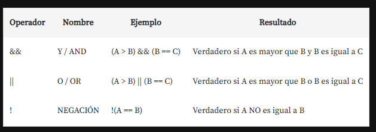

# Introduccion a la programacion con Java script

En la fase numero 1 se desarrolla la logica de programacion iniciando con javascript y apoyandoce
en html y css.

Se propone el desarrollo de un proyecto inicial, que consiste en un juego de adivinanza de números,
donde un jugador intenta adivinar un número del 1 al 10 que ha sido anotado por otra persona.

la carpeta con el ejemplo del modulo se encuentra en AdivinaNumero, está conformada por los siguientes
archivos:

    index.html --> Contiene el documento de navigacion por parte del jugador.
    app.js     --> Contiene la logica de programacion.
    style.css  --> Contiene los estilos del documento de navegacion del jugador

los comentarios en javascript son con `//texto` o con `/* texto */`
los comentarios en html `<!-- texto -->`

alert() nos permite mostrar una alerta en el navegador con la frase hola mundo, se encuentra emtre "" para
designar una cadena de texto, tambien se puede reemplazar con una variable que contenga un numero o
un texto, sintaxys:

`alert("Hola mundo");`

Para interpolar una variable en el texto que se muestra con el alert usamos comillas simples '' y el signo
$ seguido de llaves {} en el cetro de las llaves la variable ${variable}

`
    alert(`Has acertado El numero secreto es ${numeroSecreto}`)
`

Tambien es posble realizar operaciones de copmpracion durante la intermpoalcion de la siguiente manera:

    alert(`lo hiciste en ${numeroIntento == 1 ? 'un intento' : 'Intentos' }`)

notece que en l interpolacion agregamos una condicion(numeroIntento == 1) el signo interrogacion (?) que
nos asemeja al if y los dos puntos(:) que nos devuelve el valor falso del if osea el else.

promp() nos permite obtener informacion del usuario o que el usuario envie informacion a la aplicacion
o la pagina

    prompt("Digita un numero: ");

la salida del prompt sino se almacena en una variable se pierde, la forma de declarar una variable en
js seria:

    const:  se utiliza para declarar variables que no se pueden reasignar. Al igual que let, tiene un
    alcance de bloque. Sin embargo, es importante notar que si la variable es un objeto o un array,
    puedes modificar sus propiedades o elementos, pero no puedes reasignar la variable a un nuevo
    objeto o array.

    let: permite declarar variables con un alcance de bloque. Esto significa que la variable solo estará
    disponible dentro del bloque donde fue definida (por ejemplo, dentro de un if o un for). A diferencia
    de var, no se puede redeclarar la misma variable en el mismo bloque.

    var: tienen un alcance global o de función, lo que significa que pueden ser accesibles fuera del
    bloque en el que fueron definidas. Además, var permite redeclarar la misma variable sin errores.

console.log(variable o texto) nos permite mostrar un mensaje o variable en la consola del navegador,
para acceder a esta se presiona la tecla f12

Estructura condicional if, que permite comparar el número ingresado por el usuario con un número secreto
almacenado en otra variable.

es una estructura de control que permite ejecutar un bloque de código solo si se cumple una condición
específica. Es fundamental en la lógica de programación, ya que permite tomar decisiones basadas en
condiciones.

if (condición) {
    // bloque de código a ejecutar si la condición es verdadera
}

Usar dos signos de igual para comparar valores, a diferencia de un solo signo que se utiliza para asignar
valores.

if ( numero1 == numero2 ) {
    // bloque de código a ejecutar si la condición es verdadera
}

## interpolacion

E la interpolacion estamos usando comillas invertidas ``(ALT+96) para crear las plantillas literales. El formato ${marcador}
nos permite insertar un valor dinámico en la cadena. Todo lo que hay dentro ${} es evaluado como JavaScript.

Por ejemplo, podríamos escribir Se estima que la Tierra tiene ${edad + 10} mil millones de años., y funcionaría como si
hiciéramos const edad = 4.5 + 10;.

Tambien es posible concatenar de la siguiente manera:

    alert('un texto ' + variable1 + ' ' + 'otro texto ' + variable2)

## bucles

Sintaxis while:

    while (condición) {
        // Código a ejecutar mientras la condición sea verdadera
    }

while: Es la palabra clave que inicia el bucle.
(condición): Es una expresión que se evalúa antes de cada iteración del bucle. Si la condición es verdadera (true), el
código dentro de las llaves se ejecutará. Si es falsa (false), el bucle se detendrá.
{ // Código }: Aquí se coloca el bloque de código que se ejecutará repetidamente mientras la condición sea verdadera.

la variable de la condicion se inicializa al inicio con un valor del tipo que se va a manejar en el loop, luego dentro si
es necesario volver a solicitarla o cambiar su valor no se declara con let, var o cons ya que estohace que la variable se
limpie cada vez que se inicie el ciclo y esto resulta en un ciclo infinito o que nunca termina.

Bucle "for":La sintaxis es la siguiente:
Este bucle se utiliza cuando se conoce de antemano cuántas veces se debe ejecutar el bloque de código.

    for (inicialización; condición; incremento) {
        // Código a ejecutar en cada iteración
    }

Bucle "do...while":La sintaxis es:
En este caso, el bloque de código se ejecuta al menos una vez, ya que la condición se evalúa después de la ejecución del código.

    do {
        // Código a ejecutar
    } while (condición);

Bucle "for...in":
Este bucle se utiliza para iterar sobre las propiedades de un objeto. La sintaxis es:

    for (variable in objeto) {
        // Código a ejecutar para cada propiedad
    }

Bucle "for...of":Este bucle se utiliza para iterar sobre los elementos de un array o de objetos iterables. La sintaxis es:

    for (variable of iterable) {
        // Código a ejecutar para cada elemento
    }

Cada uno de estos bucles tiene su propio uso y es útil en diferentes situaciones.

En los ciclos es posible incluir un contador el cual por ejemplo puede marcar el numero de intento o las veces que se obtiene
un resultado en el ciclo hasta que este termina, se declara una variable de tipo entero que inicia en cero y se incrementa
cada vez que sucede un evento especifico en el ciclo que estamos evaluando.

En js el contador puede ser esplicito:

    variable = variable + 1

o puede implicito que incrementara de 1 en 1

    variable++

o para que el contador incremente en pasos distinto al 1 en 1

    variable += 2; incrementara de dos en dos
    variable += 3; incrementara de tres en tres

"ruptura forzada" o break en los bucles, que permite salir de un ciclo cuando se cumple una condición específica,

## Operadores de comparacion

## operadores logicos

## numero random

Definimos la variable que almacena el numero a adivinar, el cual se genera obteniendo la parte entera de un numero
random que va del 1 hasta el valor maximo determinado que es 10

    let numeroSecreto = Math.floor(Math.random() * 10) + 1;

typeof-> nos permite obtener el tipo de dato que le suminstremos a la funcion

    typeof(datos o variable);

parseInt -> convierte un dato a entero

    parseInt(dato o variable);

## Lógica de programación: explorar funciones y listas

Objetivos de la seccion:

Aprenda qué son las funciones y cómo utilizar JavaScript para manipular elementos en la pantalla
Desarrolla aún más tu lógica de programación inspirándote en un proyecto real
Aprende a usar Github para publicar tus proyectos
Descubre cómo utilizar las listas, una de las principales estructuras de datos en el mundo de la programación
Cree manipulaciones de palabras y números dinámicamente con JavaScript

### Interactuando con HTML

En este curso de lógica de programación, se va a aumentar el nivel de complejidad y se va a empezar a interactuar entre
HTML y JavaScript; Se va a seguir trabajando con el juego del número secreto del curso anterior, pero de una manera más
profesional.

Se muestra cómo conectar el archivo JavaScript con el archivo HTML usando la etiqueta `<script>`.

Se explica el concepto del Document Object Model (DOM), que permite a JavaScript acceder y manipular los elementos HTML.

Se utiliza el método document.querySelector() para seleccionar elementos HTML específicos, como el título (`<h1>`) y el
párrafo (`
`).

Una vez seleccionados los elementos, se puede acceder a sus propiedades y métodos, como innerHTML, para modificar su contenido.

Se agrega un título y un mensaje explicativo al juego del número secreto utilizando JavaScript y el DOM.

- Los eventos en java script

JavaScript tiene la capacidad de gestionar estos eventos, como el evento "click", y reaccionar a ellos.

Para manejar el evento de clic en un botón, se utiliza la propiedad onclick en la etiqueta HTML del botón, la cual llama
a una función de JavaScript.

Se muestra cómo declarar una función en JavaScript usando la palabra clave function, y cómo llamar a esa función desde
el evento onclick del botón en HTML.

Al hacer clic en el botón, se ejecuta la función declarada en JavaScript, la cual por ahora solo muestra una alerta.

#### seleccionando elementos con js

En JavaScript, se pueden seleccionar elementos HTML utilizando los métodos, asociados a document.elMetodo:

    getElementById,
    getElementsByClassName,
    getElementsByTagName,
    querySelector
    querySelectorAll.
    getElementById

Selecciona un elemento HTML único por su atributo id: Es uno de los métodos más rápidos y utilizados
getElementsByClassName: Selecciona todos los elementos que comparten una clase, Devuelve una colección de elementos
getElementsByTagName: Selecciona todos los elementos que coinciden con un nombre de etiqueta específico, Devuelve una
colección de elementos

- Ocultar elementos con js
tenemos dos opciones visibility = 'hidden' o display = 'none'

display: none oculta un elemento de manera que no se vea y altera su diseño,
visibility: hidden oculta un elemento sin cambiar su diseño.

de la siguiente manera:
`
document.queryselector('nombreDelSlector').style.display = 'none';
`
`
document.queryselector('nombreDelSlector').style.visibility = 'hidden';
`

en el queryselector('nombreDelSlector'), puede ser el nombre de un tag, clase o ID(este antecedido del simbolo #idDelSlector)
tambien podemos seleccionar el elemento con: getElementById, getElementsByClassName, getElementsByTagName, querySelector
y querySelectorAll, siendo estos metodos mas especificos que queryselector.

- Setear el atributo de un elemento en html
el elemento no posee un atributo y necesitamos deshabilitar el elemento, por lo tanto seria:

`
document.queryselector('#elIdselector').setAttribute('disabled', 'true');
`

- Remover el atributo de un elemento en html
para esto, por ejemplo un boton desabilitado por defecto a habilitado seria:

`
document.queryselector('#elIdselector').removeAttribute('disabled');
`
esto es especialmente util si el elemento depende de una accion del usuario, en el caso del ejemplo el usuario
debe ganar inicialmente el juego para llamar a un nuevo juego.

-Limpier el elemneto en html en este caso un input
Para esto creamos una funcion llamada limpiarObjeto, de la siguiente
forma:

`
function limpiarObjeto(){
    document.queryselector('nombreDelSlector').value = '';
}
`

en el nombreDelSlector, puede ser el nombre de un tag, clase o ID(este antecedido del simbolo #idDelSlector)

### Funciones

para crear una funcion seria la palabra reservada function seguida del nombre y llaves

`
function nombre(){
    aqui el codigo a ejecutar
}
`

Las funciones se mapean al inicio de la ejecucion del js y luego se van llamando conforme se necesitan, por lo tanto no
importa donde las coloquemos, pero por convencion se ubican al inicio del documento de html.

### Listas y arreglos

los arrglos o arrays en js se declaran co [], inicializar una variable que sea del tipo array seria de la siguiente
manera:

`
let nombreVariable = []:
`

lo anterior inicializa un array vacio, para ser utilizado mas adelante en nuestro codigo.

#### Manipulacion de array

para ver el contenido de un array solo pbasta con nombrar su variable y traera el elemento, por ejemplo:
`
nombreVariable;
`

para obtener un elemento del array, teniendo en cuenta que los indices inician en 0, seria, para obtener
el tercer elemento del siguiente array, responde a la logica posicion del elemento - 1, ya que inician en la posicion 0:

`
let ciudades = [Bogota Barranquilla Cali Medellin Bucaramanga];
ciudades[2]; //Cali
`

Para obtener el ultimo elemento del array  hace de la siguiente forma: array.length - 1 esto nos dara la posicion del
ultimo elemento del arraya, por ejemplo teniendo en cuenta el array ciudades:

`
let ciudades = [Bogota Barranquilla Cali Medellin Bucaramanga];
let ultimoElemento = ciudades[ciudades.length - 1]; //Bucaramanga;
`

La manipulacion de los arrays se realiza a traves de los metodos asociados a esta estructura de datos, de la sigiente
manera, teniendo en cuenta que nombreVariable es una variable tipo array declarada en el punto anterior:

`
nombreVariable.metodo;
`

por ejemplo adicionar un elemento al final del array, con el metodo push:

`
nombreVariable.push(elElementoAdicionar);
`

obtener la longitud de un array metodo length:

`
nombreVariable.length;
`

Para verificar si un elemento se encuentra en un array es posible utilizar un for each, el cual recorre el array y al
encontrar el numero lo devuelve, entre otra informacion, pero tambien podemos usar el metodo includes que nos permite saber
si un elemento se encuentra en el array, de la siguiente manera:

array.includes(elementoBuscado);

#### obtener ultimo elemento del array

Muestra multiples metodos que pueden ayudar en la obtencion del ultimo elemento del array

    [referencia]([https://](https://www.techiedelight.com/es/get-last-item-in-an-array-in-javascript/))

para el ejemplo del amigo secreto yo ultilice el metodo .at(-1), el cual me permite acceder a posiciones negativas
dentro del array, haciendo mas facil localizar elemento, una explicacion mas rapida en el siguiente video de midudev

    [Midedev-at]([https://](https://www.youtube.com/watch?v=gSSjhChWYK4&ab_channel=midulive))
