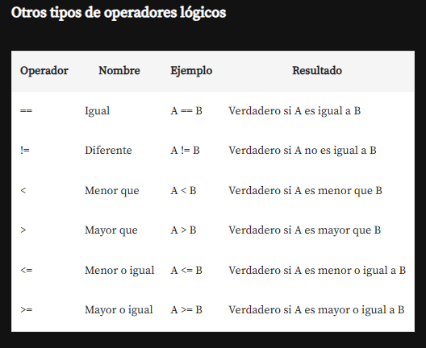
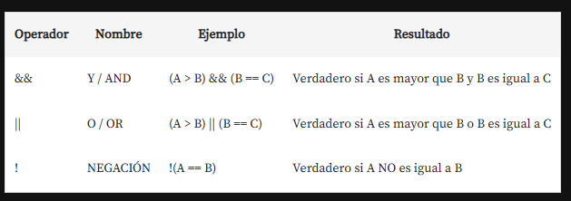

# Introduccion

En la fase numero 1 se desarrolla la logica de programacion iniciando con javascript y apoyandoce
en html y css.

Se propone el desarrollo de un proyecto inicial, que consiste en un juego de adivinanza de números,
donde un jugador intenta adivinar un número del 1 al 10 que ha sido anotado por otra persona.

la carpeta con el ejemplo del modulo se encuentra en AdivinaNumero, está conformada por los siguientes
archivos:

    index.html --> Contiene el documento de navigacion por parte del jugador.
    app.js     --> Contiene la logica de programacion.
    style.css  --> Contiene los estilos del documento de navegacion del jugador

los comentarios en javascript son con //texto o con /*texto*/
los comentarios en html <!-- texto -->

alert() nos permite mostrar una alerta en el navegador con la frase hola mundo, se encuentra emtre "" para
designar una cadena de texto, tambien se puede reemplazar con una variable que contenga un numero o
un texto, sintaxys:

    alert("Hola mundo");

Para interpolar una variable en el texto que se muestra con el alert usamos comillas simples '' y el signo
$ seguido de llaves {} en el cetro de las llaves la variable ${variable}

    alert('Has acertado El numero secreto es ${numeroSecreto}')

promp() nos permite obtener informacion del usuario o que el usuario envie informacion a la aplicacion
o la pagina

    prompt("Digita un numero: ");

la salida del prompt sino se almacena en una variable se pierde, la forma de declarar una variable en
js seria:

    const:  se utiliza para declarar variables que no se pueden reasignar. Al igual que let, tiene un
    alcance de bloque. Sin embargo, es importante notar que si la variable es un objeto o un array,
    puedes modificar sus propiedades o elementos, pero no puedes reasignar la variable a un nuevo
    objeto o array.

    let: permite declarar variables con un alcance de bloque. Esto significa que la variable solo estará
    disponible dentro del bloque donde fue definida (por ejemplo, dentro de un if o un for). A diferencia
    de var, no se puede redeclarar la misma variable en el mismo bloque.

    var: tienen un alcance global o de función, lo que significa que pueden ser accesibles fuera del
    bloque en el que fueron definidas. Además, var permite redeclarar la misma variable sin errores.

console.log(variable o texto) nos permite mostrar un mensaje o variable en la consola del navegador,
para acceder a esta se presiona la tecla f12

Estructura condicional if, que permite comparar el número ingresado por el usuario con un número secreto
almacenado en otra variable.

es una estructura de control que permite ejecutar un bloque de código solo si se cumple una condición
específica. Es fundamental en la lógica de programación, ya que permite tomar decisiones basadas en
condiciones.

if (condición) {
    // bloque de código a ejecutar si la condición es verdadera
}

Usar dos signos de igual para comparar valores, a diferencia de un solo signo que se utiliza para asignar
valores.

if ( numero1 == numero2 ) {
    // bloque de código a ejecutar si la condición es verdadera
}

Desafíos para afianzar lo aprendido

1. Muestra una alerta con el mensaje "¡Bienvenida y bienvenido a nuestro sitio web!".
2. Declara una variable llamada nombre y asígnale el valor "Lua".
3. Crea una variable llamada edady asígnale el valor 25.
4. Establece una variable numeroDeVentas y asígnale el valor 50.
5. Establece una variable saldoDisponible y asígnale el valor 1000.
6. Muestra una alerta con el texto "¡Error! Completa todos los campos".
7. Declara una variable llamada mensajeDeError y asígnale el valor "¡Error! Completa todos los campos". Ahora muestra una
   alerta con el valor de la variable mensajeDeError .
8. Utiliza un prompt para preguntar el nombre del usuario y almacénalo en la variable nombre.
9. Pide al usuario que ingrese su edad usando un prompt y almacénala en la variable edad.
10. Ahora, si la edad es mayor o igual a 18, muestra una alerta con el mensaje "¡Puedes obtener tu licencia de conducir!".

## interpolacion

E la interpolacion estamos usando comillas invertidas ``(ALT+96) para crear las plantillas literales. El formato ${marcador}
nos permite insertar un valor dinámico en la cadena. Todo lo que hay dentro ${} es evaluado como JavaScript.

Por ejemplo, podríamos escribir Se estima que la Tierra tiene ${edad + 10} mil millones de años., y funcionaría como si
hiciéramos const edad = 4.5 + 10;.

Tambien es posible concatenar de la siguiente manera:

    alert('un texto ' + variable1 + ' ' + 'otro texto ' + variable2)

Desafíos_2:

Pregunta al usuario qué día de la semana es. Si la respuesta es "Sábado" o "Domingo", muestra "¡Buen fin de semana!". De
lo contrario, muestra "¡Buena semana!".

Verifica si un número ingresado por el usuario es positivo o negativo. Muestra una alerta informativa.

Crea un sistema de puntuación para un juego. Si la puntuación es mayor o igual a 100, muestra "¡Felicidades, has ganado!".
En caso contrario, muestra "Intentalo nuevamente para ganar.".

Crea un mensaje que informe al usuario sobre el saldo de su cuenta, utilizando un template string para incluir el valor
del saldo.

Pide al usuario que ingrese su nombre mediante un prompt. Luego, muestra una alerta de bienvenida usando ese nombre.

## bucles

Sintaxis while:

    while (condición) {
        // Código a ejecutar mientras la condición sea verdadera
    }

while: Es la palabra clave que inicia el bucle.
(condición): Es una expresión que se evalúa antes de cada iteración del bucle. Si la condición es verdadera (true), el
código dentro de las llaves se ejecutará. Si es falsa (false), el bucle se detendrá.
{ // Código }: Aquí se coloca el bloque de código que se ejecutará repetidamente mientras la condición sea verdadera.

la variable de la condicion se inicializa al inicio con un valor del tipo que se va a manejar en el loop, luego dentro si
es necesario volver a solicitarla o cambiar su valor no se declara con let, var o cons ya que estohace que la variable se
limpie cada vez que se inicie el ciclo y esto resulta en un ciclo infinito o que nunca termina.

Bucle "for":La sintaxis es la siguiente:
Este bucle se utiliza cuando se conoce de antemano cuántas veces se debe ejecutar el bloque de código.

    for (inicialización; condición; incremento) {
        // Código a ejecutar en cada iteración
    }

Bucle "do...while":La sintaxis es:
En este caso, el bloque de código se ejecuta al menos una vez, ya que la condición se evalúa después de la ejecución del código.

    do {
        // Código a ejecutar
    } while (condición);

Bucle "for...in":
Este bucle se utiliza para iterar sobre las propiedades de un objeto. La sintaxis es:

    for (variable in objeto) {
        // Código a ejecutar para cada propiedad
    }

Bucle "for...of":Este bucle se utiliza para iterar sobre los elementos de un array o de objetos iterables. La sintaxis es:

    for (variable of iterable) {
        // Código a ejecutar para cada elemento
    }

Cada uno de estos bucles tiene su propio uso y es útil en diferentes situaciones.

En los ciclos es posible incluir un contador el cual por ejemplo puede marcar el numero de intento o las veces que se obtiene
un resultado en el ciclo hasta que este termina, se declara una variable de tipo entero que inicia en cero y se incrementa
cada vez que sucede un evento especifico en el ciclo que estamos evaluando.

En js el contador puede ser esplicito:

    variable = variable + 1

o puede implicito que incrementara de 1 en 1

    variable = variable++

o para que el contador incremente en pasos distinto al 1 en 1

    variable += 2; incrementara de dos en dos
    variable += 3; incrementara de tres en tres

"ruptura forzada" o break en los bucles, que permite salir de un ciclo cuando se cumple una condición específica, 

Desafio_3

Crea un contador que comience en 1 y vaya hasta 10 usando un bucle 'while'. Muestra cada número.
Crea un contador que comience en 10 y vaya hasta 0 usando un bucle 'while'. Muestra cada número.
Crea un programa de cuenta regresiva. Pide un número y cuenta desde 0 hasta ese número utilizando un bucle 'while' en la
consola del navegador.
Crea un programa de cuenta progresiva. Pide un número y cuenta desde 0 hasta ese número utilizando un bucle 'while' en la
consola del navegador.

## Operadores de comparacion

## operadores logicos

