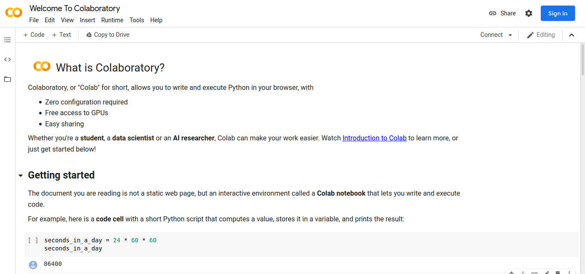
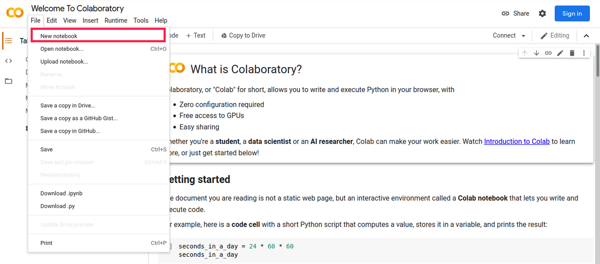

# Google colab

GoogleColab es una lista de celdas que pueden contener textos explicativos o códigos ejecutables y sus respectivas salidas.

¿Cómo usar el Colab?
Lo primero que debemos hacer para utilizar el google Colab es acceder a la siguiente dirección:

[GoogleColab]([https://](https://colab.research.google.com/notebooks/intro.ipynb))

Pronto seremos dirigidos a un notebook llamado Welcome to Colaboratory:

Este notebook explica algunas características del Colab y le muestra cómo empezar (recomiendo leer). Algunas de las
principales características del Colab son:

    - Dado que se ejecuta en una máquina de Google, no es necesario realizar ninguna configuración.
    - Google proporciona acceso gratuito a las GPU.
    - Es fácil de compartir, como cualquier archivo en el drive.

Para crear mi propio notebook! Para hacer esto, debemos hacer clic en >File, en la parte superior izquierda, y enseguida
en >New Notebook. Vea la figura siguiente:

Inicia sesion con tu cuenta de google

posterior a esto te llevara a la pantalla de carga inicial la cual podras utilizar para codificar tus instrucciones.

Tomado del blog: [Google Colab como utilizarlo](https://www.aluracursos.com/blog/google-colab-que-es-y-como-usarlo)
