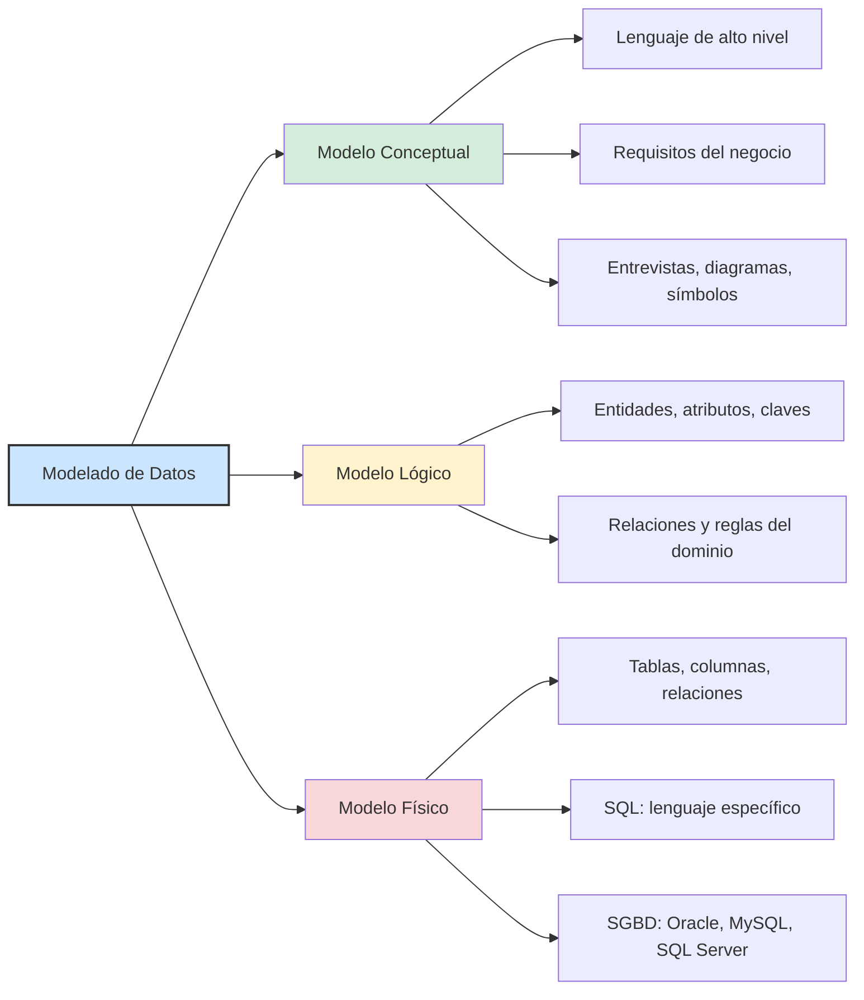
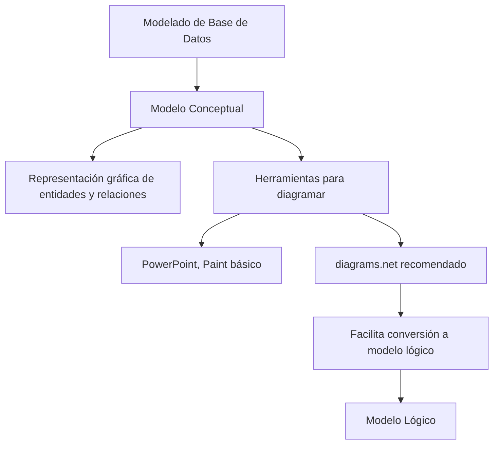
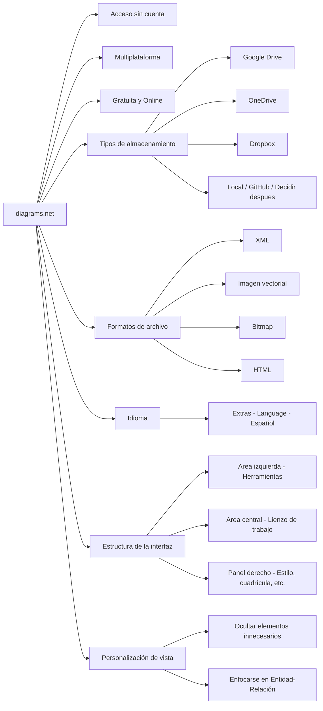
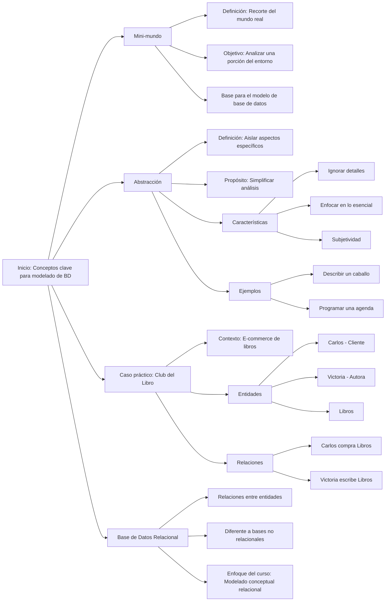
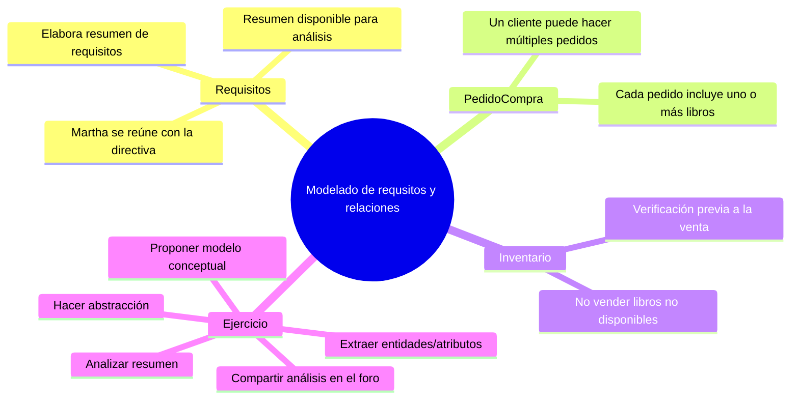
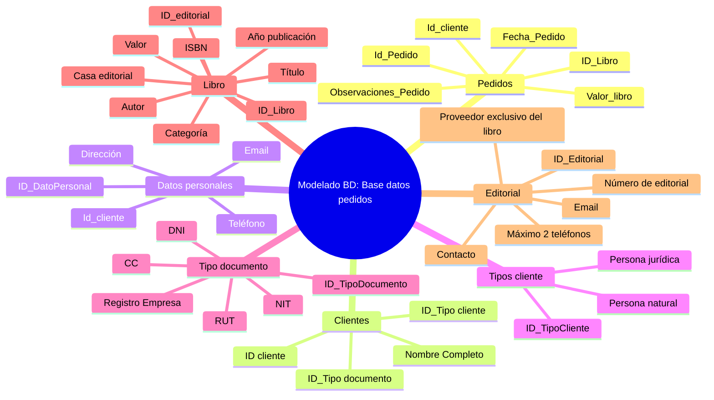
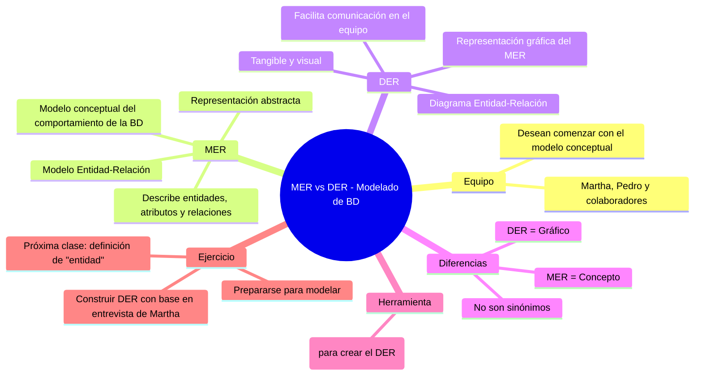
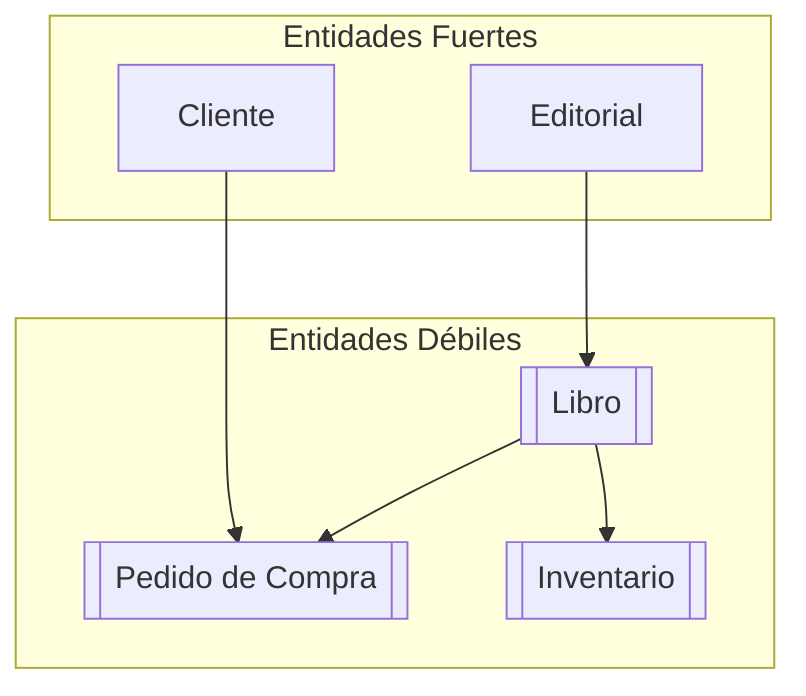

# Modelado de bases de datos en ciencia de datos

## Bases de datos

### Presentación

### **Resumen del entrenamiento: Modelaje de Base de Datos - Alura Latam**

#### **Contenido del curso:**

1. **Introducción al modelo conceptual**

   * Elaboración del esquema conceptual de una base de datos
   * Objetivo: Llegar al **diagrama entidad-relación (DER)**

2. **Temas a tratar:**

   * **Entidades**

     * Qué son
     * Tipos de entidades
   * **Relaciones**

     * Qué son
     * Tipos de relaciones entre entidades
     * **Cardinalidad**
   * **Atributos**

     * Composición de las entidades
     * Tipos de atributos

3. **Herramienta utilizada:**

   * Plataforma online: [diagrams.net](https://www.diagrams.net)
   * Se utilizará para construir el diagrama entidad-relación (DER)

4. **Importancia del modelado:**

   * Primer paso antes de usar un sistema de gestión de base de datos (SGBD)
   * Permite una mejor administración, manipulación y gestión de la base de datos

### El club del libro

El **Club del Libro** se encuentra en una etapa de expansión. Debido al aumento en las ventas y al crecimiento de la empresa,
se ha decidido mejorar la estructura de su base de datos para garantizar una gestión más eficiente de la información.

Para ello, se ha contratado a **Martha**, una especialista en bases de datos, quien trabajará junto a **Pedro** y su equipo
de sistemas dentro de la organización. Pedro planteó de inmediato una pregunta clave:

> “¿Qué sistema de gestión de bases de datos (SGBD) utilizaremos: Oracle, MySQL, SQLite, Cassandra?”

Ante esto, Martha propuso no apresurarse con la elección del software. En lugar de eso, sugirió seguir un enfoque metodológico,
comenzando con reuniones detalladas con todo el equipo para definir los pasos a seguir.

Enfatizó que **antes de seleccionar el SGBD, es fundamental entender el negocio y modelar sus procesos**.

#### **Fases iniciales del proyecto:**

1. **Reuniones con el cliente**

   * Entrevistas para comprender el funcionamiento operativo del Club del Libro.
   * Recolección de **requisitos del negocio**, flujos y necesidades específicas.

2. **Modelado conceptual del dominio**

   * Uso de diagramas, símbolos y representaciones textuales para construir un **modelo de dominio**.
   * Visualización clara de las entidades, relaciones y procesos clave del sistema.

3. **Selección del SGBD**

   * Una vez comprendido el modelo del negocio, se evaluará la tecnología más adecuada para implementar la base de datos.

Martha concluyó esta primera etapa recordando al equipo que:

> “Primero modelamos, después elegimos el SGBD.”

En el próximo paso del proyecto se profundizará en el concepto de **SGBD (Sistema de Gestión de Bases de Datos)**, para
asegurar que todo el equipo tenga claridad sobre su función y características.

---

### Para saber más: diferencia entre modelos

📦 Modelado de Datos
│  └── Estructura los datos antes de la construccion de la base de datos
│      └──Incluye recopilación, tratamiento y estructuración de datos.
│
├── 🧠 Modelo Conceptual
│   └── Comprender requisitos del sistema y del negocio
│       └── Explora estructuras y conceptos del negocio
│
├── 🧩 Modelo Lógico
│   └── Describe cómo se almacenarán los datos
│       ├── *Define* entidades
│       ├── *Define* atributos
│       ├── *Define* claves primarias y foráneas
│       └── *Establece* relaciones
│
└── 🛠️ Modelo Físico
    └── Describe la implementación técnica de la base de datos
        ├── Define tablas y columnas
        ├── Define relaciones entre tablas
        └── Utiliza lenguaje SQL

### Entendiendo SGBD

🔹 Contexto

   Martha fue contratada para liderar el modelado de la base de datos del Club del Libro, organización en expansión que
   necesita estructurar eficientemente su información. Durante las primeras reuniones con el equipo, surgieron dudas sobre
   qué tecnología usar, como Oracle, MySQL o Cassandra. Sin embargo, Martha aclaró que antes de elegir un SGBD, es necesario
   entender los procesos del negocio.

🔹 Desarrollo

   Pedro, miembro del equipo de sistemas, propuso empezar directamente con un SGBD.

   Martha corrigió esta aproximación, enfatizando que el modelado conceptual es el primer paso.

   Explicó que:

      el SGBD (Sistema de Gestión de Base de Datos) es solo la herramienta para manipular la información una vez diseñada
      la estructura lógica y conceptual de los datos.

   Se resaltó la necesidad de comprender bien los requisitos del negocio para luego pasar al diseño de la base de datos.
   Martha hizo una distinción clara entre los niveles de lenguaje involucrados:

      El modelo conceptual, por ejemplo, es un modelo de alto nivel y los modelos físicos son considerados de bajo nivel.

      Lenguaje de alto nivel → utilizado en el modelado conceptual, Ya el modelo de bajo nivel es más cercano al lenguaje
      de la máquina

      Lenguaje de bajo nivel → relacionado con el funcionamiento del SGBD, es más cercano al lenguaje humano.

      Un ejemplo de modelo de alto nivel conceptual es la representación de la estructura del banco de datos a través de
      formas geométricas.

      Un ejemplo de modelo de bajo nivel físico es la creación de un proyecto para la estructuración del banco de datos
      a través de comandos que serán interpretados por la máquina.

🔹 Resultado

   El equipo comprendió que no se trata solo de elegir un software, sino de diseñar una base de datos funcional basada
   en la comprensión del negocio.

   Se acordó trabajar primero el modelado conceptual antes de seleccionar herramientas tecnológicas.

   Se generó conciencia sobre la diferencia entre decir "base de datos MySQL" y entender que eso en realidad es un SGBD.

🔹 Conclusión

   Martha guiará al equipo paso a paso desde el modelado conceptual, usando un enfoque basado en entrevistas y comprensión
   de procesos, para garantizar que el sistema resultante sea coherente, útil y escalable.



### Escogiendo la aplicación

Claro, aquí tienes el texto ordenado y separado en dos partes claras: una parte correspondiente a la
**solución del ejercicio** (lo que hace el equipo) y otra a los **conceptos fundamentales** (el conocimiento que se explica).

---

## ✅ SOLUCIÓN DEL EJERCICIO

### 🔹 Contexto

Tras comprender la importancia del **modelo conceptual** gracias a la explicación de Martha, el equipo —liderado por Pedro— entendió que debía construir un **esquema gráfico** representando los elementos clave del negocio.

### 🔹 Desarrollo

El equipo se preguntó si podían usar herramientas simples como **PowerPoint** o **Paint** para realizar el gráfico del
modelo conceptual. Martha respondió afirmativamente, aclarando que lo importante en esta fase era representar visualmente el modelo.

Sin embargo, también destacó que si bien cualquier software gráfico puede servir, sería más eficiente utilizar una herramienta
que **facilite convertir ese modelo conceptual en un modelo lógico más adelante**.

### 🔹 Resultado

Martha sugirió usar **diagrams.net**, una herramienta en línea, gratuita y especializada en la creación de diagramas para
modelado de datos, ideal para este tipo de trabajo.

El equipo accedió a seguir su recomendación y se preparó para aprender a utilizar esta herramienta en la siguiente sesión.

---

## 📌 CONCEPTOS CLAVE – VISUAL EXPLICATIVO



---

### 📘 RESUMEN DE CONCEPTOS

| Concepto                     | Explicación                                                                                                                             |
| ---------------------------- | --------------------------------------------------------------------------------------------------------------------------------------- |
| **Modelo Conceptual**        | Representación visual de los elementos del negocio (entidades, relaciones, atributos), sin detalles técnicos.                           |
| **Software de Diagramación** | Cualquier programa que permita crear gráficos puede utilizarse, pero se recomienda uno que facilite el paso posterior al modelo lógico. |
| **diagrams.net**             | Herramienta gratuita, en línea y especializada en diagramas, ideal para modelado de bases de datos.                                     |

---

### Usando diagrams.net

Claro, aquí tienes el texto reorganizado separando claramente lo que corresponde al **ejercicio práctico** (lo que hace
el equipo y cómo usan la herramienta) y lo que corresponde a los **conceptos fundamentales** (lo que se enseña sobre diagrams.net y el modelado):

---

## ✅ SOLUCIÓN DEL EJERCICIO – PASOS DESARROLLADOS

### 🔹 Selección de la herramienta

* Martha y el equipo identificaron que antes de comenzar con el modelado conceptual necesitaban una herramienta para crear el esquema.
* Martha sugirió **diagrams.net**, una plataforma gratuita disponible en línea, sin necesidad de registro.

### 🔹 Acceso y configuración básica

* Acceden al sitio web: **diagrams.net**.
* Eligen la opción **"Start now"** para iniciar sin descargar nada.
* Se les presenta la opción de **dónde guardar los archivos**: Google Drive, OneDrive, Dropbox, GitHub, localmente o
  decidir después. Para avanzar, eligen "Decidir después".
* Renombran el archivo inicial como **modelo.xml**.

### 🔹 Personalización de la interfaz

* Cambian el idioma desde **Extras > Language > Español**.
* Recargan la página para aplicar el cambio.

### 🔹 Organización del espacio de trabajo

* Desde el menú **Vista**, eliminan categorías de formas innecesarias (general, básico, flechas, diagrama de flujo) y
  dejan solo la opción **“Diagrama de entidad-relación”**.
* Identifican:

  * Área izquierda: herramientas y objetos disponibles.
  * Área central: lienzo o área de trabajo.
  * Panel derecho: propiedades del diagrama (estilo, cuadrícula, vista, tamaño de página, etc.).

---

## 📘 CONCEPTOS CLAVE – EXPLICACIÓN DIDÁCTICA



---

## Modelado entidad relacion

### El mini-mundo

1. Mini-mundo

   Definición: Recorte o fragmento del mundo real.

   Objetivo: Analizar una pequeña porción del entorno con profundidad.

   Importancia: Es la base sobre la que se estructura el modelo de base de datos.

2. Abstracción

   Definición: Proceso mental para aislar detalles específicos de un conjunto complejo.

   Permite:

   Ignorar detalles irrelevantes.

   Enfocarse en lo esencial.

   Manejar diferentes niveles de detalle según el propósito.

   Ejemplos:

   Descripción de un caballo (subjetiva).

   Programación de una agenda (por bloques de tiempo).

3. Aplicación práctica del Mini-mundo

   Caso: E-commerce del Club del Libro.

   Entidades:

   Carlos (Cliente)

   Victoria (Autora)

   Libros

   Relaciones:

   Carlos → compra → Libros.

   Victoria → escribe → Libros.

4. Base de datos relacional

   Relaciona entidades mediante vínculos lógicos.

   Diferente de bases de datos no relacionales (no se centran en relaciones).

   Enfoque del curso: Modelado conceptual de bases de datos relacionales.

## Resumen esquematico



### Entrevista con los directores

Aquí tienes el análisis del texto, dividido en **conceptos clave** y **ejercicio planteado**, seguido de un esquema final tipo **mermaid mindmap en Markdown** para visualizar los elementos de forma jerárquica.

---

## ✅ CONCEPTOS CLAVE

### 📌 1. **Análisis de Requisitos**

* Martha se reunió con la directiva del Club del Libro.
* Elaboró un resumen con los requisitos funcionales del negocio.
* El resumen está disponible para consulta y análisis.
* Permite realizar el modelado de la base de datos a partir de esos requerimientos.

### 📌 2. **Identificación del Cliente**

* Tipos de clientes:

  * Persona natural
  * Persona jurídica
* Información requerida:

  * Persona natural: RUT (Registro Único Tributario), DNI
  * Persona jurídica: NIT (Número de Identificación Tributaria), Registro Único de Empresa
* Datos generales comunes:

  * Nombre
  * Dirección
  * Teléfono
  * Email

### 📌 3. **Información del Producto (Libros)**

* Información clave:

  * Título
  * Categoría
  * Código ISBN
  * Año de publicación
  * Valor
  * Casa editorial
  * Autor

### 📌 4. **Editorial**

* Proveedor de libros.
* Cada libro está asociado a **una única editorial** (exclusividad).
* Datos requeridos:

  * Número de la editorial
  * Máximo dos teléfonos
  * Nombre del contacto
  * Email

### 📌 5. **Pedidos de Compra**

* Un cliente puede realizar uno o más pedidos.
* Cada pedido puede contener uno o más libros.

### 📌 6. **Inventario**

* Antes de concretar un pedido, se debe verificar la disponibilidad del libro en el inventario.
* Regla de negocio importante: **No vender libros inexistentes**.

---

## 📝 EJERCICIO PROPUESTO

* Analizar el resumen de requisitos.
* Extraer las entidades y atributos principales.
* Realizar la **abstracción de datos**.
* Proponer un modelo conceptual (diagrama ER).
* Opcional: compartir observaciones y análisis en el foro del curso.

---

## 🧠 Modelado de requisitos



---

## Modelado logico de la base de pedidos



---

### Para saber más: la importancia de las entrevistas

El modelado de datos es la base para lograr un buen proyecto final del banco de datos. Una de las etapas más importantes
de este proceso es la entrevista con los(as) clientes, en la cual serán identificadas las reglas de negocio del proyecto.

Cuando no identificamos las necesidades del proyecto, puede presentarse la necesidad de realizar esta etapa nuevamente,
generando así, retrasos en todo el proceso.

La entrevista dará toda la dirección a nuestro proyecto. A través de ella, conocemos todos los detalles del negocio y
podemos estructurar los próximos pasos. Un factor importante de este proceso es saber de quién vamos a recopilar la
información, o sea, debemos entrevistar a una o a más personas que puedan brindarnos todos los detalles importantes del
negocio.

Otro factor es escoger las preguntas ideales para definir todos los puntos clave del proyecto. En esta etapa, la persona
que realiza la entrevista necesita tener un conocimiento previo sobre los puntos más relevantes para la construcción del
proyecto, lo que posibilita recolectar la información realmente esencial para el modelado del banco de datos.

En resumen, la entrevista es la base para construir un proyecto coherente que atienda las necesidades del cliente.

### MER y DER

Aquí tienes el análisis del segundo texto. Separamos los **conceptos clave** de la parte **ejercicio/instrucción**, y al final te presento un **esquema tipo mindmap en Mermaid para Markdown**.

---

## ✅ CONCEPTOS CLAVE MER y DER

### 📌 1. **Motivación del equipo**

* El equipo (Pedro, Martha y demás) está entusiasmado por comenzar con el modelo conceptual de la base de datos.

### 📌 2. **Diferencia entre MER y DER**

* **MER (Modelo Entidad-Relación):**

  * Representación **abstracta** del modelo conceptual.
  * Describe **objetos (entidades)**, **características (atributos)** y **relaciones**.
  * Es la **idea** del sistema de datos.

* **DER (Diagrama Entidad-Relación):**

  * **Representación gráfica** del MER.
  * **Materializa** visualmente el modelo conceptual.
  * Ayuda a la **comunicación** entre los miembros del equipo.

* ⚠️ Aclaración: MER ≠ DER
  Aunque suelen confundirse, **el MER es conceptual**, y **el DER es visual/tangible**.

### 📌 3. **Importancia del DER**

* Mejora la comunicación del equipo.
* Permite una comprensión común de las relaciones entre entidades.

### 📌 4. **Herramienta utilizada**

* Se usará **diagrams.net** (herramienta online gratuita) para crear el DER.

### 📌 5. **Fuente del modelo**

* El DER se construirá a partir del **resumen de la entrevista** entre Martha y los directivos del Club del Libro.

---

## 📝 EJERCICIO PROPUESTO BASE DE DATOS

* Esperar a profundizar en el concepto de **entidad** antes de iniciar el modelado práctico.
* Próxima clase abordará el concepto de entidad.
* El equipo debe prepararse para trabajar directamente sobre el DER utilizando el resumen anterior como base.

---

## 🧠 Mermaid Mindmap en Markdown



---

### Diferencia entre MER y DER

El MER es un modelo conceptual usado para describir los objetos (entidades) con sus características (atributos) y cómo
estas se relacionan entre sí (relaciones). En cuanto que el DER es una representación gráfica que ayuda a visualizar la
información en situaciones prácticas.

Mientras que MER es un modelo conceptual, el DER es su representación gráfica y principal herramienta.

## Entidades que son

### Qué son entidades

---

#### 📘 Entidad

* Objeto único en el mundo real (persona, cosa, concepto).
* Puede ser tangible (ej. carro) o abstracta (ej. departamento).
* Puede representarse en singular con artículos: el, la, los, un, etc.
* Ejemplos:

  * Clientes → entidad
  * Empresa → entidad
  * Carros → entidad
  * Departamento de ventas → entidad
  * Vendedores → entidad

#### 🧱 Tipos de Entidad

* **Entidad fuerte**:

  * Existe por sí sola.
  * Ejemplo: Cliente.
* **Entidad débil**:

  * Depende de otra entidad para existir.
  * Se verá en detalle más adelante.

#### 🧰 Representación en diagramas

* Se usan **rectángulos** para representar entidades.
* También se pueden usar rectángulos con esquinas redondeadas (forma alternativa).
* Se colocan en el lienzo arrastrando el objeto desde el panel izquierdo.
* Se nombra en **singular** (ej. Cliente, no Clientes).

#### 💻 Herramienta: diagrams.net

* Requiere iniciar sesión para guardar el progreso.
* Dispone de varios objetos para modelado (tabla, fila, lista, ítem, entidad, atributos).
* La entidad se crea con un clic y se puede renombrar con doble clic.

---

#### 🧪 Ejercicio Práctico

1. Ingresar a **diagrams.net**.
2. Crear una **entidad** en el lienzo.
3. Usar rectángulo desde el menú izquierdo.
4. Nombrar la entidad como **Cliente** (forma singular).
5. Prepararse para introducir **entidades fuertes y débiles** en próximas lecciones.

---

#### 🧠 Esquema Mermaid Flowchart en Markdown

```mermaid
flowchart LR
    A[Inicio: Aula 3] --> B[Concepto de Entidad]

    B --> C[Entidad = Objeto único del mundo real]
    C --> C1[Puede ser una persona, cosa o concepto]
    C --> C2[Se identifica con artículos: el, la, los, un...]

    C --> D[Ejemplos de entidades]
    D --> D1[Clientes]
    D --> D2[Empresa]
    D --> D3[Carros]
    D --> D4[Departamento de Ventas]
    D --> D5[Vendedores]

    B --> E[Tipos de entidades]
    E --> E1[Entidad fuerte → existe por sí sola (ej. Cliente)]
    E --> E2[Entidad débil → depende de otra entidad]

    B --> F[Representación gráfica en diagrams.net]
    F --> F1[Rectángulos y rectángulos redondeados]
    F --> F2[Entidad se nombra en singular]
    F --> F3[Creación arrastrando desde panel izquierdo]

    B --> G[Herramienta diagrams.net]
    G --> G1[Iniciar sesión]
    G --> G2[Guardar avances]
    G --> G3[Panel con objetos: tabla, fila, lista, entidad...]

    F --> H[Ejercicio práctico]
    H --> H1[Crear entidad "Cliente"]
    H --> H2[Colocarla en el lienzo]
    H --> H3[Nombrarla con doble clic]

    H --> I[Prepararse para próxima clase sobre entidades débiles]
```

---

### Identificando las entidades

Imagina un escenario ficticio en el que fuimos contratados por una floristería que necesita un sistema para el control
de ventas. Inicialmente, será almacenada la información de cada cliente, tales como: Nombre, dirección, fecha de nacimiento
y edad.

En cuanto a cada producto, almacenaremos la descripción, cantidad en inventario y el precio. En esta floristería también
existen las personas colaboradoras, que tienen nombre, dirección, salario y cargo. Escoge la alternativa que indica cuáles
son las entidades presentes en el proyecto de la floristería.

Clientes, Producto y Colaborador(a).

Estas son las entidades del proyecto de la floristería. Cada una de ellas posee atributos que las describen como, por
ejemplo, el atributo precio, de la entidad producto.

### Entidad fuerte vs débil

### **1. Entidades**

* **Entidad Fuerte**

  * Existe de forma independiente.
  * No depende de ninguna otra entidad para existir.
  * Tiene **clave principal (primary key)**.
  * Ejemplos: `Empleado`, `Cliente`.

* **Entidad Débil**

  * Depende de una entidad fuerte para existir.
  * No puede existir sin su entidad asociada.
  * No tiene clave principal, pero sí una **clave parcial**, que junto con la clave de la entidad fuerte, forma una clave compuesta.
  * Representación gráfica: **rectángulo dentro de otro rectángulo**.
  * Ejemplos: `Dependiente`, `Pedido`.

### **2. Relación entre Entidades**

* Una entidad débil **no puede existir sin su entidad fuerte relacionada**.
* Se ilustra con ejemplos como:

  * `Empleado` (fuerte) ↔ `Dependiente` (débil)
  * `Cliente` (fuerte) ↔ `Pedido` (débil)

### **3. Claves**

* **Clave principal** (entidad fuerte): identificador único de la entidad.
* **Clave parcial** (entidad débil): requiere la clave de la entidad fuerte para ser única.

---

## 🧩 **Ejercicio**

* **Escenario del Club del Libro**

  * Se desea registrar empleados y los dependientes de cada empleado para asignar beneficios.
  * No se puede tener **dependientes** sin un **empleado** asociado.
  * En el modelo, `Empleado` se representa como **entidad fuerte**, y `Dependiente` como **entidad débil**.

* **Segundo ejemplo:**

  * Un cliente hace un **pedido de compra**.
  * No puede existir un `Pedido` si no hay un `Cliente`.
  * `Cliente`: entidad fuerte.
  * `Pedido`: entidad débil.

---

## 🧠 **Esquema tipo Merdmind (Markdown)**

```markdown
# Entidades en Diagramas ER

## Entidades
- **Fuerte**
  - Existe por sí misma
  - Tiene clave principal (PK)
  - Ejemplos:
    - Empleado
    - Cliente

- **Débil**
  - Depende de otra entidad
  - No tiene clave principal, usa clave parcial
  - Representación: rectángulo doble
  - Ejemplos:
    - Dependiente (de Empleado)
    - Pedido (de Cliente)

## Relaciones
- Entidad débil ↔ Entidad fuerte
  - Dependencia necesaria
  - Clave compuesta: clave fuerte + clave parcial

## Representación en diagrams.net
- Entidad fuerte → rectángulo simple
- Entidad débil → rectángulo doble

## Ejemplos prácticos
- Club del Libro:
  - Empleado (Fuerte) ↔ Dependiente (Débil)
  - Cliente (Fuerte) ↔ Pedido (Débil)
```

### Entidades en el DER

---

## ✅ **Conceptos Relevantes**

### **1. Identificación de Entidades**

* Una **entidad** es cualquier objeto del mundo real sobre el cual se desea almacenar información.
* Normalmente se identifica como un **sustantivo** dentro del texto (por ejemplo: cliente, libro, editorial...).
* Una entidad puede tener varios **atributos**, que son características o datos relacionados con esa entidad (por ejemplo: nombre, dirección, NIT).

### **2. Entidades Fuertes vs. Débiles** (mencionadas como repaso)

* **Entidad Fuerte**

  * Existe independientemente.
  * No necesita de otra entidad para existir.
* **Entidad Débil**

  * Depende de otra entidad para existir.
  * Se analizarán más adelante para clasificarlas correctamente.

### **3. Atributos**

* No son entidades, pero son **propiedades** que describen una entidad.
* Ejemplos:

  * Cliente → nombre, dirección, teléfono, tipo de persona (natural/jurídica), RUT, NIT.
  * Libro → título.
  * Editorial → información asociada.

### **4. Reglas de Negocio**

* Un **libro solo puede pertenecer a una editorial** (relación uno a uno o uno a muchos).
* Un cliente puede **realizar varios pedidos de compra** (relación uno a muchos).
* Se debe verificar el **inventario antes de procesar un pedido** (condición operativa).

---

## 🧪 **Ejercicio Aplicado**

### **Texto de la entrevista - Extracción de entidades**

#### Entidades identificadas

1. **Cliente**
2. **Libro**
3. **Editorial**
4. **Pedido de compra**
5. **Inventario**

#### Atributos mencionados (por entidad)

* **Cliente**

  * Tipo (persona natural / jurídica)
  * RUT / DNI (natural)
  * NIT / Registro de empresa (jurídica)
  * Nombre
  * Dirección
  * Teléfono

* **Libro**

  * Título

* **Editorial**

  * Información asociada

* **Pedido de compra**

  * (No se mencionan atributos directamente, pero se infiere relación con cliente y libro)

* **Inventario**

  * Disponibilidad del libro

#### Relaciones inferidas

* Cliente **realiza** Pedido(s)
* Pedido **contiene** Libro(s)
* Libro **pertenece a una** Editorial
* Pedido **verifica** Inventario

---

## 🧠 **Esquema**

```markdown
# Modelo Entidad-Relación: Entidades y Conceptos

## 1. Entidades Identificadas
- **Cliente**
- **Libro**
- **Editorial**
- **Pedido de Compra**
- **Inventario**

## 2. Atributos por Entidad
### Cliente
- Tipo (Natural / Jurídica)
- RUT / DNI / NIT
- Nombre
- Dirección
- Teléfono

### Libro
- Título

### Editorial
- Información asociada

### Inventario
- Disponibilidad

## 3. Relaciones
- Cliente → realiza → Pedido de compra
- Pedido de compra → incluye → Libro(s)
- Libro → pertenece a → Editorial
- Pedido de compra → consulta → Inventario

## 4. Reglas de Negocio
- Un libro pertenece a una sola editorial.
- Un cliente puede realizar múltiples pedidos.
- Verificar disponibilidad en inventario antes de procesar pedidos.

## 5. Criterio de Identificación de Entidades
- Se reconocen como **sustantivos** en el texto.
- Atributos no se consideran entidades, describen las entidades.

## 6. Clasificación Futura
- Entidades serán clasificadas como **fuertes** o **débiles** en un análisis posterior.
```

### Entidades fuertes y débiles

Aquí tienes el **análisis del texto**, con los **conceptos relevantes separados del ejercicio**, seguido de un **esquema tipo flowchart en formato Mermaid**.

---

## 🧠 **Conceptos más relevantes**

### 🔹 **Entidades**

Se identifican y clasifican cinco entidades dentro del contexto de un sistema e-commerce de venta de libros:

| Entidad              | Tipo   | Justificación                                                            |
| -------------------- | ------ | ------------------------------------------------------------------------ |
| **Cliente**          | Fuerte | No depende de otra entidad. Puede registrarse sin realizar compras.      |
| **Editorial**        | Fuerte | Es quien produce/publica los libros. No depende de ninguna otra entidad. |
| **Libro**            | Débil  | Necesita estar asociado a una editorial.                                 |
| **Pedido de compra** | Débil  | Depende de la existencia de un cliente y al menos un libro.              |
| **Inventario**       | Débil  | Su existencia depende de los libros que estén disponibles.               |

---

### 🧩 **Criterios para clasificar entidades**

* **Entidad fuerte**: no depende de ninguna otra entidad para existir.
* **Entidad débil**: necesita de otra entidad para tener sentido o existencia.

---

## ✅ **Ejercicio (desarrollo paso a paso)**

1. **Identificación de entidades** a partir del análisis de entrevista.
2. **Clasificación de entidades** en fuertes (resaltadas en amarillo) y débiles (en azul).
3. **Justificación de cada clasificación** a través de reglas del negocio.
4. **Construcción del diagrama** entidad-relación parcial.
5. **Uso de rectángulos dobles para entidades débiles**.
6. **Preparación para próxima etapa**: establecer relaciones entre entidades.

---

## 📊 **Esquema tipo flowchart (Mermaid)**



---

## Diagrama Entidad-Relacion

## Atributos
