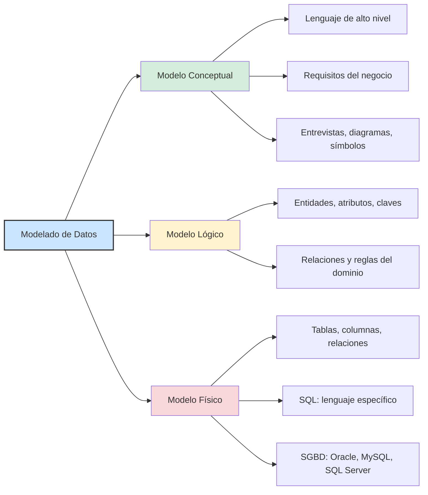
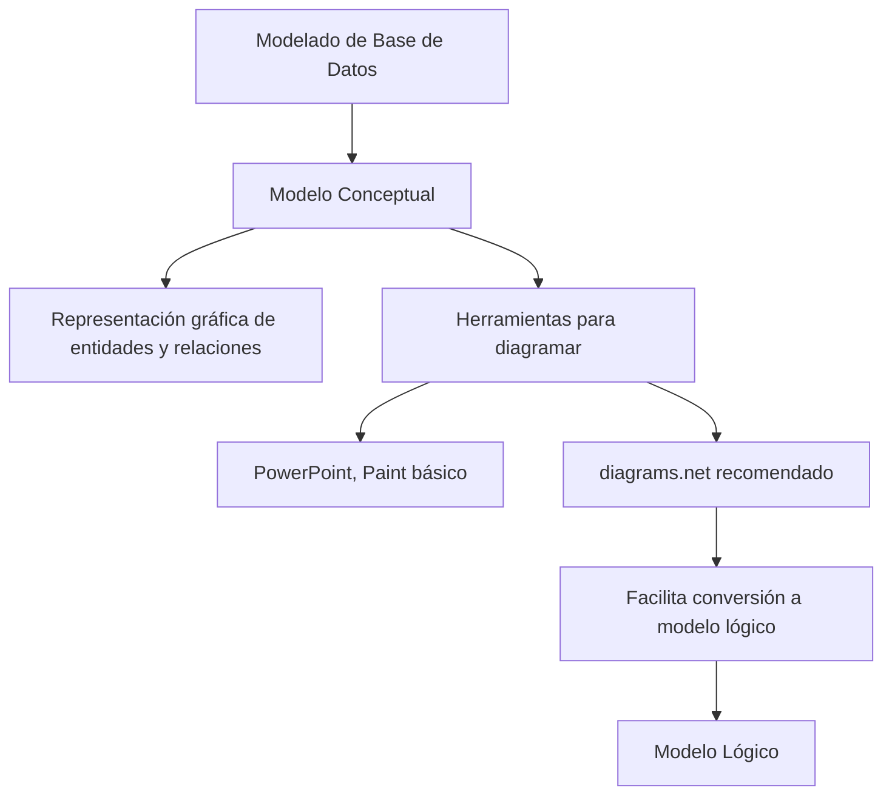

# Modelado de bases de datos en ciencia de datos

## Bases de datos

### Presentación

### **Resumen del entrenamiento: Modelaje de Base de Datos - Alura Latam**

#### **Contenido del curso:**

1. **Introducción al modelo conceptual**

   * Elaboración del esquema conceptual de una base de datos
   * Objetivo: Llegar al **diagrama entidad-relación (DER)**

2. **Temas a tratar:**

   * **Entidades**

     * Qué son
     * Tipos de entidades
   * **Relaciones**

     * Qué son
     * Tipos de relaciones entre entidades
     * **Cardinalidad**
   * **Atributos**

     * Composición de las entidades
     * Tipos de atributos

3. **Herramienta utilizada:**

   * Plataforma online: [diagrams.net](https://www.diagrams.net)
   * Se utilizará para construir el diagrama entidad-relación (DER)

4. **Importancia del modelado:**

   * Primer paso antes de usar un sistema de gestión de base de datos (SGBD)
   * Permite una mejor administración, manipulación y gestión de la base de datos

### El club del libro

El **Club del Libro** se encuentra en una etapa de expansión. Debido al aumento en las ventas y al crecimiento de la empresa,
se ha decidido mejorar la estructura de su base de datos para garantizar una gestión más eficiente de la información.

Para ello, se ha contratado a **Martha**, una especialista en bases de datos, quien trabajará junto a **Pedro** y su equipo
de sistemas dentro de la organización. Pedro planteó de inmediato una pregunta clave:

> “¿Qué sistema de gestión de bases de datos (SGBD) utilizaremos: Oracle, MySQL, SQLite, Cassandra?”

Ante esto, Martha propuso no apresurarse con la elección del software. En lugar de eso, sugirió seguir un enfoque metodológico,
comenzando con reuniones detalladas con todo el equipo para definir los pasos a seguir.

Enfatizó que **antes de seleccionar el SGBD, es fundamental entender el negocio y modelar sus procesos**.

#### **Fases iniciales del proyecto:**

1. **Reuniones con el cliente**

   * Entrevistas para comprender el funcionamiento operativo del Club del Libro.
   * Recolección de **requisitos del negocio**, flujos y necesidades específicas.

2. **Modelado conceptual del dominio**

   * Uso de diagramas, símbolos y representaciones textuales para construir un **modelo de dominio**.
   * Visualización clara de las entidades, relaciones y procesos clave del sistema.

3. **Selección del SGBD**

   * Una vez comprendido el modelo del negocio, se evaluará la tecnología más adecuada para implementar la base de datos.

Martha concluyó esta primera etapa recordando al equipo que:

> “Primero modelamos, después elegimos el SGBD.”

En el próximo paso del proyecto se profundizará en el concepto de **SGBD (Sistema de Gestión de Bases de Datos)**, para
asegurar que todo el equipo tenga claridad sobre su función y características.

---

### Para saber más: diferencia entre modelos

📦 Modelado de Datos
│  └── Estructura los datos antes d ela construccion de la base de datos
│      └──Incluye recopilación, tratamiento y estructuración de datos.
│
├── 🧠 Modelo Conceptual
│   └── Comprender requisitos del sistema y del negocio
│       └── Explora estructuras y conceptos del negocio
│
├── 🧩 Modelo Lógico
│   └── Describe cómo se almacenarán los datos
│       ├── *Define* entidades
│       ├── *Define* atributos
│       ├── *Define* claves primarias y foráneas
│       └── *Establece* relaciones
│
└── 🛠️ Modelo Físico
    └── Describe la implementación técnica de la base de datos
        ├── Define tablas y columnas
        ├── Define relaciones entre tablas
        └── Utiliza lenguaje SQL

### Entendiendo SGBD

🔹 Contexto

   Martha fue contratada para liderar el modelado de la base de datos del Club del Libro, organización en expansión que
   necesita estructurar eficientemente su información. Durante las primeras reuniones con el equipo, surgieron dudas sobre
   qué tecnología usar, como Oracle, MySQL o Cassandra. Sin embargo, Martha aclaró que antes de elegir un SGBD, es necesario
   entender los procesos del negocio.

🔹 Desarrollo

   Pedro, miembro del equipo de sistemas, propuso empezar directamente con un SGBD.

   Martha corrigió esta aproximación, enfatizando que el modelado conceptual es el primer paso.

   Explicó que:

      el SGBD (Sistema de Gestión de Base de Datos) es solo la herramienta para manipular la información una vez diseñada
      la estructura lógica y conceptual de los datos.

   Se resaltó la necesidad de comprender bien los requisitos del negocio para luego pasar al diseño de la base de datos.
   Martha hizo una distinción clara entre los niveles de lenguaje involucrados:

      El modelo conceptual, por ejemplo, es un modelo de alto nivel y los modelos físicos son considerados de bajo nivel.

      Lenguaje de alto nivel → utilizado en el modelado conceptual, Ya el modelo de bajo nivel es más cercano al lenguaje
      de la máquina

      Lenguaje de bajo nivel → relacionado con el funcionamiento del SGBD, es más cercano al lenguaje humano.

      Un ejemplo de modelo de alto nivel conceptual es la representación de la estructura del banco de datos a través de
      formas geométricas.

      Un ejemplo de modelo de bajo nivel físico es la creación de un proyecto para la estructuración del banco de datos
      a través de comandos que serán interpretados por la máquina.

🔹 Resultado

   El equipo comprendió que no se trata solo de elegir un software, sino de diseñar una base de datos funcional basada
   en la comprensión del negocio.

   Se acordó trabajar primero el modelado conceptual antes de seleccionar herramientas tecnológicas.

   Se generó conciencia sobre la diferencia entre decir "base de datos MySQL" y entender que eso en realidad es un SGBD.

🔹 Conclusión

   Martha guiará al equipo paso a paso desde el modelado conceptual, usando un enfoque basado en entrevistas y comprensión
   de procesos, para garantizar que el sistema resultante sea coherente, útil y escalable.



### Escogiendo la aplicación

Claro, aquí tienes el texto ordenado y separado en dos partes claras: una parte correspondiente a la
**solución del ejercicio** (lo que hace el equipo) y otra a los **conceptos fundamentales** (el conocimiento que se explica).

---

## ✅ SOLUCIÓN DEL EJERCICIO – SECCIONES

### 🔹 Contexto

Tras comprender la importancia del **modelo conceptual** gracias a la explicación de Martha, el equipo —liderado por Pedro—
entendió que debía construir un **esquema gráfico** representando los elementos clave del negocio.

### 🔹 Desarrollo

El equipo se preguntó si podían usar herramientas simples como **PowerPoint** o **Paint** para realizar el gráfico del
modelo conceptual. Martha respondió afirmativamente, aclarando que lo importante en esta fase era representar visualmente el modelo.

Sin embargo, también destacó que si bien cualquier software gráfico puede servir, sería más eficiente utilizar una herramienta
que **facilite convertir ese modelo conceptual en un modelo lógico más adelante**.

### 🔹 Resultado

Martha sugirió usar **diagrams.net**, una herramienta en línea, gratuita y especializada en la creación de diagramas para
modelado de datos, ideal para este tipo de trabajo.

El equipo accedió a seguir su recomendación y se preparó para aprender a utilizar esta herramienta en la siguiente sesión.

---

## 📌 CONCEPTOS CLAVE – VISUAL EXPLICATIVO



---

### 📘 RESUMEN DE CONCEPTOS

| Concepto                     | Explicación                                                                                                                             |
| ---------------------------- | --------------------------------------------------------------------------------------------------------------------------------------- |
| **Modelo Conceptual**        | Representación visual de los elementos del negocio (entidades, relaciones, atributos), sin detalles técnicos.                           |
| **Software de Diagramación** | Cualquier programa que permita crear gráficos puede utilizarse, pero se recomienda uno que facilite el paso posterior al modelo lógico. |
| **diagrams.net**             | Herramienta gratuita, en línea y especializada en diagramas, ideal para modelado de bases de datos.                                     |

---

### Usando diagrams.net

Claro, aquí tienes el texto reorganizado separando claramente lo que corresponde al **ejercicio práctico** (lo que hace
el equipo y cómo usan la herramienta) y lo que corresponde a los **conceptos fundamentales** (lo que se enseña sobre diagrams.net y el modelado):

---

## ✅ SOLUCIÓN DEL EJERCICIO – PASOS DESARROLLADOS

### 🔹 Selección de la herramienta

* Martha y el equipo identificaron que antes de comenzar con el modelado conceptual necesitaban una herramienta para crear el esquema.
* Martha sugirió **diagrams.net**, una plataforma gratuita disponible en línea, sin necesidad de registro.

### 🔹 Acceso y configuración básica

* Acceden al sitio web: **diagrams.net**.
* Eligen la opción **"Start now"** para iniciar sin descargar nada.
* Se les presenta la opción de **dónde guardar los archivos**: Google Drive, OneDrive, Dropbox, GitHub, localmente o
  decidir después. Para avanzar, eligen "Decidir después".
* Renombran el archivo inicial como **modelo.xml**.

### 🔹 Personalización de la interfaz

* Cambian el idioma desde **Extras > Language > Español**.
* Recargan la página para aplicar el cambio.

### 🔹 Organización del espacio de trabajo

* Desde el menú **Vista**, eliminan categorías de formas innecesarias (general, básico, flechas, diagrama de flujo) y
  dejan solo la opción **“Diagrama de entidad-relación”**.
* Identifican:

  * Área izquierda: herramientas y objetos disponibles.
  * Área central: lienzo o área de trabajo.
  * Panel derecho: propiedades del diagrama (estilo, cuadrícula, vista, tamaño de página, etc.).

---

## 📘 CONCEPTOS CLAVE – EXPLICACIÓN DIDÁCTICA

```mermaid
graph LR
    A[diagrams.net]

    A --> B[Acceso sin cuenta]
    A --> C[Multiplataforma]
    A --> D[Gratuita y Online]

    A --> E[Tipos de almacenamiento]
    E --> E1[Google Drive]
    E --> E2[OneDrive]
    E --> E3[Dropbox]
    E --> E4[Local / GitHub / Decidir despues]

    A --> F[Formatos de archivo]
    F --> F1[XML]
    F --> F2[Imagen vectorial]
    F --> F3[Bitmap]
    F --> F4[HTML]

    A --> G[Idioma]
    G --> G1[Extras - Language - Español]

    A --> H[Estructura de la interfaz]
    H --> H1[Area izquierda - Herramientas]
    H --> H2[Area central - Lienzo de trabajo]
    H --> H3[Panel derecho - Estilo, cuadrícula, etc.]

    A --> I[Personalización de vista]
    I --> I1[Ocultar elementos innecesarios]
    I --> I2[Enfocarse en Entidad-Relación]
```                                       |

---

## Modelado entidad relacion

## Entidades

## Diagrama Entidad-Relacion

## Atributos
