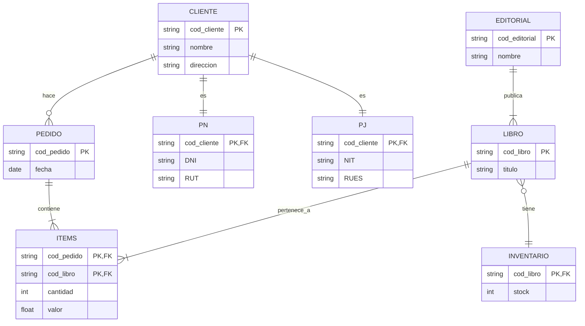

# Modelado de bases de datos relacionales: modelado lógico y físico

## Tipos de modelado

### Presentación

---

  1. **Modelo conceptual**
  2. **Modelo lógico**
  3. **Modelo físico**

---

### 🔹 Modelo Conceptual

* Se representa mediante un **diagrama entidad-relación (ER)**.
* Permite definir las **entidades**, **atributos**, **relaciones**.
* Es la base para construir el modelo lógico.

---

### 🔹 Modelo Lógico

* Evolución del modelo conceptual.
* Representa estructuras que se **parecen a tablas**.
* Incluye **campos** e **identificadores**.
* No está vinculado aún a un SGBD específico.
* Incluye relaciones y restricciones entre entidades.

---

### 🔹 Modelo Físico

* Etapa final de diseño de la base de datos.
* Las entidades del modelo lógico se convierten en **tablas reales**.
* Se definen:

  * **Tipos de datos**
  * **Dominios de los atributos**
  * **Restricciones físicas**
* Especificación de un **SGBD** (Sistema de Gestión de Base de Datos) adecuado.

---

### 🔹 SGBD (Sistema de Gestión de Base de Datos)

* Se selecciona en función del modelo físico.
* Permite implementar y gestionar la base de datos real.

---

## 🧪 Ejercicio descrito en el video

* Partir de un modelo conceptual preexistente (ER).
* Convertirlo en modelo lógico con campos y relaciones.
* Finalmente, transformarlo en modelo físico incluyendo:

  * Tipos de datos
  * Restricciones
  * Dominio
* Preparar el entorno de trabajo para comenzar con el modelado.

---

## 🔁 Esquema tipo **flowchart Mermaid**

```mermaid
flowchart TD
    A[Inicio del curso] --> B[Modelo Conceptual]
    B --> C[Diagrama Entidad-Relación (ER)]
    C --> D[Entidades, Atributos, Relaciones]
    D --> E[Modelo Lógico]
    E --> F[Similitud con Tablas]
    F --> G[Campos e Identificadores]
    G --> H[Modelo Físico]
    H --> I[Conversión a Tablas Reales]
    I --> J[Dominio y Restricciones]
    J --> K[Selección del SGBD]
    K --> L[Implementación de la BD]
```

### Diversos modelos

---

### 🔹 Fases del modelado de bases de datos

* **Modelo conceptual → Modelo lógico → Modelo físico**

---

### 🔹 Modelo Conceptual concepto

* Fue realizado previamente por Martha y su equipo.
* Representado mediante un **diagrama entidad-relación (ER)**.
* Define entidades y relaciones a alto nivel, sin detalles técnicos.

---

### 🔹 Modelo Lógico conceptos

* Se construye **a partir del modelo conceptual**.
* Se asemeja más a una base de datos real.
* En esta fase:

  * **Las entidades se convierten en relaciones** (tablas).
  * Se definen **campos** y **restricciones**.
  * Se especifican:

    * **Cardinalidad mínima y máxima**.
    * Relación entre entidades.
  * Se usa la herramienta **diagrams.net** con formato **vertical**.

---

### 🔹 Modelo Físico conceptos

* Se construye a partir del modelo lógico.
* Implementado con la herramienta **SQL Power Architect**.
* En esta fase:

  * Las relaciones ya se denominan **tablas**.
  * Los campos se conocen como **columnas**.
  * Se definen:

    * **Dominios**
    * **Tipos de datos**
    * **Restricciones (ej. NOT NULL, claves primarias/foráneas)**
    * **Aceptación de valores nulos**
  * Se incorpora **simbología de cardinalidad** (ej. pata de gallina).

---

### 🔹 Herramientas mencionadas

* **diagrams.net**: Para diseño del modelo lógico.
* **SQL Power Architect**: Para creación del modelo físico.

---

## 🧪 Ejercicio descrito

* Retomar el **modelo conceptual** ya creado por Martha y su equipo.
* Convertirlo en un **modelo lógico**, incluyendo relaciones, campos, cardinalidades y restricciones.
* Representarlo en **formato vertical** usando **diagrams.net**.
* Luego, transformar ese modelo lógico en un **modelo físico** con **SQL Power Architect**, definiendo dominios, restricciones, tipo de datos y cardinalidades visuales.
* Prepararse para iniciar la construcción del modelo lógico en el próximo video.

---

## 🔁 Esquema modelado logico y fisico

```mermaid
flowchart TD
    A[Inicio del entrenamiento] --> B[Modelo Conceptual]
    B --> C[Diagrama Entidad-Relación (ER)]
    C --> D[Convertir a Modelo Lógico]
    D --> E[Usar diagrams.net]
    E --> F[Formato vertical]
    F --> G[Relaciones, Campos, Restricciones, Cardinalidades]
    G --> H[Convertir a Modelo Físico]
    H --> I[Usar SQL Power Architect]
    I --> J[Tablas, Columnas, Dominios]
    J --> K[Tipo de dato, NOT NULL, Claves]
    K --> L[Simbología de Cardinalidad]
    L --> M[Base de datos lista para implementación]
```

### Características de MLD y MFD

Una de las integrantes del equipo de Martha, Johanna, estaba tratando de entender las características que diferencian los
Modelos Lógicos de Datos (MLDs) de los Modelos Físicos de Datos (MFDs). Para ello, a Martha compartió con ella un material
para profundizar sus estudios y prepararla para la implementación del proyecto de bases de datos del Club del Libro.

¡Vamos a ayudarle a Johanna!

De acuerdo con lo que aprendimos en los videos, ¿Cuáles alternativas definen mejor las características y diferencias entre
los Modelos Lógicos de Datos (MLDs) y los Modelos Físicos de Datos (MFDs)?

El Modelo Físico de Datos (MFD) es ampliamente utilizado en proyectos tanto ágiles como tradicionales y presenta el proyecto
de la base de datos con una mayor riqueza de detalles frente al Modelo Lógico de Datos (MLD). El Modelo Físico de Datos (MFD)
es ampliamente utilizado por presentar detalles como las tablas asociativas, por indicar los tipos de datos de cada campo
y las claves que serán necesarias para trazar las relaciones.

El Modelo Lógico de Datos (MLD) es raramente utilizado en proyectos ágiles, pues el enfoque de este modelo radica en describir
los conceptos de dominio involucrados en una base de datos. El Modelo Lógico de Datos (MLD) raramente es utilizado en proyectos
ágiles, al contrario del Modelo Físico de Datos (MFD).

### Para saber más: representando el modelo lógico

El modelo lógico de datos es creado a partir de las descripciones de los datos representadas en un modelo conceptual. Este
describe cómo los datos serán almacenados en la base de datos, identificando las entidades, los atributos, las claves
principales y foráneas y sus relaciones.

Hay dos formas que podemos utilizar para representar el modelo lógico: La forma horizontal o la forma vertical. Durante
el curso fue utilizada la representación vertical, donde los atributos (que más adelante serán llamados campos) son representados
uno abajo del otro, los atributos clave son identificados y las relaciones son representadas a través de líneas uniendo
una relación a la otra:


En la forma horizontal, los atributos (campos) son presentados uno al lado del otro, los atributos clave son subrayados en
las relaciones y las relaciones son representadas a través de una flecha, que sale de la relación dependiente y llega a la
relación propietaria. Ya las cardinalidades no son representadas, como en el ejemplo a continuación:


Las dos formas son válidas y pueden ser utilizadas para representar el modelo lógico de datos. Normalmente la forma más
    utilizada es la forma vertical, por ser semejante a la representación final de las relaciones en una base de datos.

### Modelado lógico conceptos

---

* Secuencia: **Modelo Entidad-Relación (Conceptual) → Modelo Lógico → Modelo Físico**
* Confirmación de que el **modelo conceptual** está listo para avanzar al modelo lógico.

---

### 🔹 Herramienta utilizada

* **diagrams.net**:

  * Herramienta **online y gratuita**.
  * Permite crear **diagramas tipo tabla** para representar relaciones.
  * No requiere instalación (opcional versión desktop).
  * Se puede trabajar en **modo horizontal o vertical** (en este caso: **vertical**).

---

### 🔹 Configuraciones iniciales de diagrams.net

* **Start now**: iniciar sin crear cuenta.
* Cambiar idioma a español: Extras → Lenguaje.
* Cargar archivo del diagrama entidad-relación guardado previamente.

---

### 🔹 Modelo Lógico proceso

* Utiliza el concepto de **relaciones** (en lugar de entidades).
* Cada **relación** se representa como una **tabla**.
* Se utiliza la opción **"tabla"** desde el menú de entidades.
* Importancia de utilizar correctamente los términos:

  * **Entidad** (Modelo Conceptual) = **Relación** (Modelo Lógico) = **Tabla** (Modelo Físico).
* El diseño será **vertical**.

---

### 🔹 Diagrama Entidad-Relación anterior

* Se reutiliza el **diagrama conceptual anterior**.
* Incluye **cardinalidad mínima y máxima** (ej.: entre "pedido" y "items").

---

### 🔹 Observaciones pedagógicas

* Se aclara que a veces se dirá "relación" o "tabla" indistintamente, pero son equivalentes según el contexto del modelo.
* Se prepara un **modelo lógico en blanco** para iniciar el traspaso del modelo conceptual.
* El proceso detallado de traspaso se abordará en el siguiente video.

---

## 🧪 Ejercicio descrito modelado

1. Acceder a **diagrams.net**.
2. Configurar idioma en español.
3. Abrir el **diagrama entidad-relación** creado anteriormente.
4. Identificar las **entidades y sus relaciones**, junto con la **cardinalidad**.
5. Crear un nuevo diagrama en blanco llamado `modelo_logico`.
6. Seleccionar el formato **vertical**.
7. Insertar **tablas** (relaciones) una por una a partir del modelo conceptual.
8. Preparar el entorno para continuar el modelado lógico en el siguiente video.

---

## 🔁 Esquema de la leccion

```mermaid
flowchart TD
    A[Inicio del video] --> B[Confirmación de modelo conceptual completo]
    B --> C[Acceder a diagrams.net]
    C --> D[Configurar idioma a español]
    D --> E[Abrir diagrama Entidad-Relación previo]
    E --> F[Verificar cardinalidades entre entidades]
    F --> G[Crear nuevo diagrama en blanco: modelo_logico]
    G --> H[Seleccionar formato vertical]
    H --> I[Insertar tablas usando opción "tabla"]
    I --> J[Copiar cada entidad y relación al nuevo modelo lógico]
    J --> K[Prepararse para continuar modelado en próximo video]
```

### Pasos para el MLD

El proceso de modelado de bases de datos no se inicia con la construcción del modelo lógico; este sigue algunos pasos
anteriores que irán a ayudar en la construcción de este modelo, es decir, los pasos que acompañamos en el proyecto desarrollado
por Martha hasta aquí.

Con base en lo que aprendimos hasta ahora, ¿Cuáles son estos pasos y cuál es su orden en el proceso de modelado de bases de datos?

Entrevista con el usuario, creación del mini mundo, modelo conceptual, modelo lógico y modelo físico. Siguiendo todos los
pasos indicados es posible modelar una base de datos atendiendo todos los requisitos del usuario.

## Modelado lógico

### Entidades y atributos

---

1. **Modelo Lógico**

   * Segunda etapa después del diagrama entidad-relación (E-R).
   * En el modelo lógico, las entidades se llaman *relaciones*.
   * Usa nomenclatura estándar: nombres de relaciones en mayúscula, atributos en minúscula.
   * Evitar caracteres especiales para facilitar su conversión al modelo físico.

2. **Entidades Fuertes vs. Entidades Débiles**

   * **Entidades Fuertes**:

     * Cliente
     * Editorial
   * **Entidades Débiles** (se modelarán después):

     * Libro
     * Pedido
     * Inventario

3. **Atributos y Reglas de Nomenclatura**

   * Clave primaria: representada por `uniqueID`.
   * Atributos derivados deben descomponerse en sus partes componentes.

     * Ejemplo: “dirección” → calle, barrio, ciudad, estado.
   * Uso de guión bajo para separar palabras en nombres de atributos: `cod_cliente`, `nombre_contacto`.

4. **Uso de la Herramienta diagrams.net**

   * Crear tablas usando opción *Table*.
   * Agregar filas con “insertar fila en la parte inferior”.
   * No es necesario instalar versión de escritorio.

---

## 🧪 EJERCICIO REALIZADO (Modelo lógico)

### Relación: CLIENTE

* **cod\_cliente** (clave primaria)
* nombre
* teléfono
* email
* calle
* barrio
* ciudad
* estado

### Relación: EDITORIAL

* **cod\_editorial** (clave primaria)
* nombre\_contacto
* email
* teléfono\_1
* teléfono\_2

---

## 📊 DIAGRAMA TIPO FLOWCHART (MERMAID)

```mermaid
flowchart TD
    A[Inicio Aula 2] --> B[Identificar entidades fuertes]
    B --> C[Entidades fuertes: Cliente y Editorial]
    C --> D[Crear relación CLIENTE]
    D --> E[Agregar atributos: cod_cliente, nombre, teléfono, email]
    E --> F[Descomponer dirección: calle, barrio, ciudad, estado]
    C --> G[Crear relación EDITORIAL]
    G --> H[Agregar atributos: cod_editorial, nombre_contacto, email, teléfono_1, teléfono_2]
    F --> I[Guardar modelo lógico]
    H --> I
    I --> J[Próximo paso: entidades débiles (libro, pedido, inventario)]
```

### Clasificando items en el MLD

Ahora que Martha inició con la construcción del modelo lógico, ella va a transferir la información del modelo conceptual
dejándolo estructurado en forma de tabla. Antes de continuar con este paso, Johanna presentó algunas dudas en cuanto a la
clasificación de los atributos y entidades dentro de este nuevo modelo.

Con base en lo que aprendimos, clasifica los datos del siguiente modelo lógico determinando la relación/tabla, el atributo
clave principal y los atributos simples para ayudar a Johanna a entender este proceso.

Colaborador(a)      1
id_colaborador(a)   2
nombre              3
teléfono            4
dirección           5
% de comisión       6

1 - relación/tabla; 2 - atributo clave principal; 3 - atributo simple, 4 - atributo simple, 5 - atributo simple, 6 - atributo simple.

Colaborador(a) es la tabla y el atributo que es único para cada inserción de la tabla es ID_Colabolador(a), este nos ayudará
a identificar cada fila de la tabla. Todos los demás atributos pueden considerarse como atributos simples.

### Entidades débiles

---

1. **Definición**:

   * No poseen una clave primaria completa.
   * Se identifican mediante una **clave parcial** combinada con una **clave foránea (FK)** que apunta a una entidad fuerte.

2. **Nomenclatura y estructura**:

   * Se utilizan tanto **PK (clave parcial)** como **FK** al definirlas.
   * Ejemplo: `cod_pedido` es una clave parcial, combinada con `cod_cliente` como FK.

3. **Relación con entidades fuertes**:

   * Pedido se relaciona con Cliente.
   * Libro se relaciona con Editorial.
   * Inventario se relaciona con Libro (no directamente con Editorial).

4. **Herramientas de modelado**:

   * Se usa la opción de tabla con PK y FK en el modelador.
   * Agregar filas según atributos usando la opción "insertar fila en la parte inferior".

5. **Atributos comunes**:

   * Atributos de las entidades no deben incluirse de forma redundante (ej. no repetir "editorial" si ya se tiene una FK con esa entidad).

6. **Conceptos pendientes (mencionados para próximos pasos)**:

   * Entidades asociativas.
   * Atributos de especialización.

---

## 🧪 EJERCICIO REALIZADO (Modelo lógico - Entidades débiles)

### Relación: PEDIDO

* **cod\_cliente** (FK)
* **cod\_pedido** (PK - clave parcial)
* fecha
* valor

### Relación: LIBRO

* **cod\_editorial** (FK)
* **cod\_libro** (PK - clave parcial)
* título
* categoría
* ISBN
* año\_publicación
* valor
* autor

### Relación: INVENTARIO

* **cod\_libro** (FK)
* **cod\_editorial** (FK)
* cantidad

---

## 📊 DIAGRAMA conceptos entidades debiles

```mermaid
flowchart TD
    A[Inicio: Crear entidades débiles] --> B[Entidad débil: PEDIDO]
    B --> C[Definir FK: cod_cliente]
    C --> D[Definir clave parcial: cod_pedido (PK)]
    D --> E[Agregar atributos: fecha, valor]

    A --> F[Entidad débil: LIBRO]
    F --> G[Definir FK: cod_editorial]
    G --> H[Definir clave parcial: cod_libro (PK)]
    H --> I[Agregar atributos: título, categoría, ISBN, año_publicación, valor, autor]

    A --> J[Entidad débil: INVENTARIO]
    J --> K[Definir FK: cod_libro]
    K --> L[Definir FK adicional: cod_editorial]
    L --> M[Agregar atributo: cantidad]

    M --> N[Fin de modelado de entidades débiles]
    N --> O[Próximo paso: entidades asociativas y especialización]
```

---

### Representando entidades fuertes y débiles

A cada nuevo aprendizaje, Johanna se siente aún más confiada para ayudar en la construcción del modelo lógico del Club del
Libro. Junto a ella, aprendemos como construir las entidades fuertes y débiles (relaciones) de modelado de datos como las
presentadas a continuación.


Entretanto, para lograr construir nuestro proyecto en el modelo físico más adelante, es muy importante tener la certeza de
que comprendemos correctamente cómo diferenciarlas en el modelo lógico.

Con base en lo que aprendimos y de acuerdo con diagrams.net, escoge las alternativas que diferencia entre las entidades
fuertes y débiles en el modelo lógico:

    Una entidad débil siempre depende de una entidad fuerte para su existencia, representada por una clave foránea FK,
    pero puede poseer una clave identificadora, conocida como clave parcial, representada por la sigla PK. Esto es lo que
    observamos en el diagrama presentado.

    Toda entidad fuerte posee una clave principal, que en el modelado lógico está representado por las siglas PK. Por
    otro lado, una entidad débil necesita de al menos una clave foránea, representada por las siglas FK.Esta es la forma
    de distinguir las entidades.

### Atributo de especialización y generalización

#### 1. **Entidad Asociativa**

* Es una **tabla intermedia** entre dos entidades que tienen una relación N\:M.
* Contiene **claves foráneas** de las entidades relacionadas.
* En este caso, se llama **Items** y relaciona `Pedido` con `Libro`.

#### 2. **Claves**

* **Claves foráneas (FK)**: Referencian otras tablas.
* **Claves parciales**: Parte de una clave primaria compuesta.
* **Claves primarias (PK)**: Identifican de forma única una fila.

#### 3. **Atributos de Especialización**

* Cuando una entidad (como `Cliente`) tiene subtipos con atributos únicos.
* Se crean tablas separadas: `PN` (Persona Natural) y `PJ` (Persona Jurídica).
* Cada subtipo tiene como PK y FK el `cod_cliente`.

#### 4. **Relaciones entre entidades**

* Uso de relaciones sin título para enlazar entidades.
* Se establece **cardinalidad** mínima y máxima para definir el tipo de relación.

#### 5. **Cardinalidad**

* Determina la cantidad de ocurrencias permitidas en cada lado de una relación.
* Ejemplo: Cliente puede tener 0 o muchos Pedidos (0\:N).
* Persona Natural o Jurídica solo se asocia a 1 Cliente (0,1) y viceversa (1,1).

#### 6. **Modelo Lógico**

* Representa las entidades, relaciones y cardinalidades.
* Paso previo a construir el modelo físico (tablas con tipos de datos, índices, etc.).

---

### 🧪 Ejercicio (esquematización del modelo lógico)

#### Entidades principales:

* `Cliente`
* `Pedido`
* `Libro`
* `Editorial`
* `Inventario`

#### Entidades derivadas:

* `PN` (Persona Natural): `DNI`, `RUT`
* `PJ` (Persona Jurídica): `NIT`, `RUES`

#### Entidad asociativa:

* `Items`: `cod_pedido`, `cod_libro`, `cantidad`, `valor`

#### Relaciones y cardinalidades clave:

* Cliente → Pedido: **0\:N**
* Cliente → PN / PJ: **1:1**, lado subtipo **0:1**
* Pedido → Items: **1\:N**
* Libro → Items: **1\:N**
* Libro → Inventario: **1:0..N**
* Inventario → Libro: **1\:N**
* Editorial → Libro: **1\:N**

---

### 📈 Diagrama tipo flowchart (Mermaid)



---

### Para saber más: atributos de relaciones

Al desarrollar el modelo conceptual de un proyecto, podemos identificar que algunas relaciones poseen atributos, que son
normalmente conocidos como atributos de relación. Estos atributos están directamente vinculados a una relación, pero durante
el proceso de desarrollo del modelo conceptual es necesario mover estos atributos para una de las entidades participantes
de relación y ellos pasan a ser conocidos como atributos migrados.

Existen reglas para que la migración del atributo de relación para una entidad sea hecho. En relaciones del tipo 1:1 o 1:N
pueden ser migrados para una de las entidades participantes:

En relaciones 1:1 el atributo puede ser migrado para cualquier una de las entidades pertenecientes a la relación, ya que
las dos entidades reciben apenas una instancia por vez de la relación.

Vamos a utilizar como ejemplo la siguiente relación, en la cual es necesario almacenar la información de cuando el colaborador(a)
comenzó a gerenciar el departamento.


Al leer la cardinalidad:

Un colaborador(a) gestiona apenas un departamento, o sea, la entidad colaborador(a) recibe apenas una ocurrencia a la vez
de la relación.

Un departamento puede ser gestionado apenas por un colaborador(a), o sea, la entidad departamento recibe apenas una ocurrencia
a la vez de la relación.

Aunque conceptualmente este pertenezca a la relación “gestiona”, el atributo fecha puede ser migrado para cualquiera de
las entidades participantes de la relación, pues las dos entidades reciben apenas una ocurrencia a la vez de la relación.


En las relaciones 1:N el atributo será migrado para la entidad que recibe apenas una instancia a la vez de la relación.
Vamos a utilizar como ejemplo la siguiente relación. En ella es necesario almacenar la información sobre cuándo el colaborador(a)
comenzó a trabajar para el departamento.


Al leer la cardinalidad:

Un colaborador(a) trabaja tan solo para un departamento, o sea, la entidad colaborador(a) recibe apenas una ocurrencia a
la vez de la relación.

Un departamento puede tener varios colaboradores(as), o sea, la entidad departamento recibe varias ocurrencias de la relación.

Siendo así, migramos el atributo para el lado N de la relación, para la entidad colaborador(a), pues esta entidad recibe
apenas una ocurrencia a la vez de la relación.


En las relaciones N:M, la regla es un poco diferente, ya que ninguna de las entidades participantes de la relación reciben
apenas una instancia a la vez de la relación. En estos casos, los atributos no son migrados hacia una entidad y permanecen
en la relación, creando así una nueva entidad, conocida como entidad asociativa. Esta es compuesta por los atributos provenientes
de las dos entidades vinculadas a la relación y por sus propios atributos.

Vamos a utilizar como ejemplo la siguiente relación, donde es necesario almacenar la información de cuántas horas un colaborador(a)
trabaja en un proyecto.


Al leer la cardinalidad:

Un colaborador(a) trabaja en varios proyectos, o sea, la entidad colaborador(a) recibe varias ocurrencias de la relación.

Un proyecto puede tener varios colaboradores(as) trabajando, o sea, la entidad proyecto recibe varias ocurrencias de la relación.

Siendo así, no migramos el atributo para una de las entidades participantes de la relación, ya que las dos entidades reciben
varias ocurrencias a la vez de la relación que, posteriormente, se convertirá en una nueva entidad.

## Modelado físico

## Tipos de datos, tablas y columnas

## Concluyendo el proyecto
