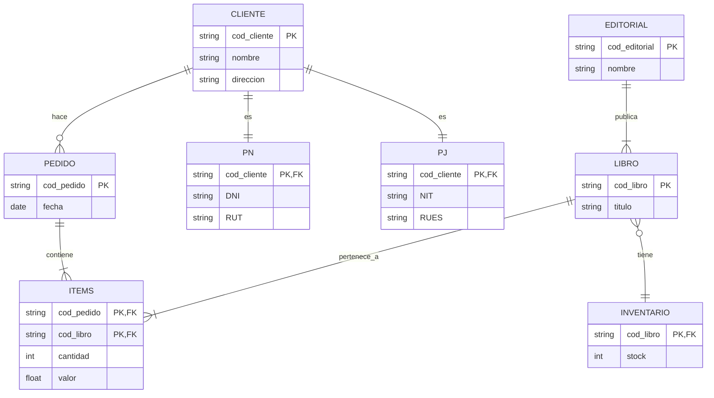
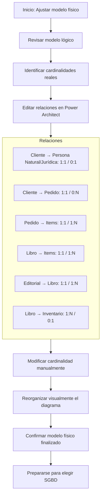

# Modelado de bases de datos relacionales: modelado lógico y físico

## Tipos de modelado

### Presentación

---

  1. **Modelo conceptual**
  2. **Modelo lógico**
  3. **Modelo físico**

---

### 🔹 Modelo Conceptual

* Se representa mediante un **diagrama entidad-relación (ER)**.
* Permite definir las **entidades**, **atributos**, **relaciones**.
* Es la base para construir el modelo lógico.

---

### 🔹 Modelo Lógico

* Evolución del modelo conceptual.
* Representa estructuras que se **parecen a tablas**.
* Incluye **campos** e **identificadores**.
* No está vinculado aún a un SGBD específico.
* Incluye relaciones y restricciones entre entidades.

---

### 🔹 Modelo Físico

* Etapa final de diseño de la base de datos.
* Las entidades del modelo lógico se convierten en **tablas reales**.
* Se definen:

  * **Tipos de datos**
  * **Dominios de los atributos**
  * **Restricciones físicas**
* Especificación de un **SGBD** (Sistema de Gestión de Base de Datos) adecuado.

---

### 🔹 SGBD (Sistema de Gestión de Base de Datos)

* Se selecciona en función del modelo físico.
* Permite implementar y gestionar la base de datos real.

---

## 🧪 Ejercicio descrito en el video

* Partir de un modelo conceptual preexistente (ER).
* Convertirlo en modelo lógico con campos y relaciones.
* Finalmente, transformarlo en modelo físico incluyendo:

  * Tipos de datos
  * Restricciones
  * Dominio
* Preparar el entorno de trabajo para comenzar con el modelado.

---

## 🔁 Esquema tipo **flowchart Mermaid**

```mermaid
flowchart TD
    A[Inicio del curso] --> B[Modelo Conceptual]
    B --> C[Diagrama Entidad-Relación (ER)]
    C --> D[Entidades, Atributos, Relaciones]
    D --> E[Modelo Lógico]
    E --> F[Similitud con Tablas]
    F --> G[Campos e Identificadores]
    G --> H[Modelo Físico]
    H --> I[Conversión a Tablas Reales]
    I --> J[Dominio y Restricciones]
    J --> K[Selección del SGBD]
    K --> L[Implementación de la BD]
```

### Diversos modelos

---

### 🔹 Fases del modelado de bases de datos

* **Modelo conceptual → Modelo lógico → Modelo físico**

---

### 🔹 Modelo Conceptual concepto

* Fue realizado previamente por Martha y su equipo.
* Representado mediante un **diagrama entidad-relación (ER)**.
* Define entidades y relaciones a alto nivel, sin detalles técnicos.

---

### 🔹 Modelo Lógico conceptos

* Se construye **a partir del modelo conceptual**.
* Se asemeja más a una base de datos real.
* En esta fase:

  * **Las entidades se convierten en relaciones** (tablas).
  * Se definen **campos** y **restricciones**.
  * Se especifican:

    * **Cardinalidad mínima y máxima**.
    * Relación entre entidades.
  * Se usa la herramienta **diagrams.net** con formato **vertical**.

---

### 🔹 Modelo Físico conceptos

* Se construye a partir del modelo lógico.
* Implementado con la herramienta **SQL Power Architect**.
* En esta fase:

  * Las relaciones ya se denominan **tablas**.
  * Los campos se conocen como **columnas**.
  * Se definen:

    * **Dominios**
    * **Tipos de datos**
    * **Restricciones (ej. NOT NULL, claves primarias/foráneas)**
    * **Aceptación de valores nulos**
  * Se incorpora **simbología de cardinalidad** (ej. pata de gallina).

---

### 🔹 Herramientas mencionadas

* **diagrams.net**: Para diseño del modelo lógico.
* **SQL Power Architect**: Para creación del modelo físico.

---

## 🧪 Ejercicio descrito

* Retomar el **modelo conceptual** ya creado por Martha y su equipo.
* Convertirlo en un **modelo lógico**, incluyendo relaciones, campos, cardinalidades y restricciones.
* Representarlo en **formato vertical** usando **diagrams.net**.
* Luego, transformar ese modelo lógico en un **modelo físico** con **SQL Power Architect**, definiendo dominios, restricciones, tipo de datos y cardinalidades visuales.
* Prepararse para iniciar la construcción del modelo lógico en el próximo video.

---

## 🔁 Esquema modelado logico y fisico

```mermaid
flowchart TD
    A[Inicio del entrenamiento] --> B[Modelo Conceptual]
    B --> C[Diagrama Entidad-Relación (ER)]
    C --> D[Convertir a Modelo Lógico]
    D --> E[Usar diagrams.net]
    E --> F[Formato vertical]
    F --> G[Relaciones, Campos, Restricciones, Cardinalidades]
    G --> H[Convertir a Modelo Físico]
    H --> I[Usar SQL Power Architect]
    I --> J[Tablas, Columnas, Dominios]
    J --> K[Tipo de dato, NOT NULL, Claves]
    K --> L[Simbología de Cardinalidad]
    L --> M[Base de datos lista para implementación]
```

### Características de MLD y MFD

Una de las integrantes del equipo de Martha, Johanna, estaba tratando de entender las características que diferencian los
Modelos Lógicos de Datos (MLDs) de los Modelos Físicos de Datos (MFDs). Para ello, a Martha compartió con ella un material
para profundizar sus estudios y prepararla para la implementación del proyecto de bases de datos del Club del Libro.

¡Vamos a ayudarle a Johanna!

De acuerdo con lo que aprendimos en los videos, ¿Cuáles alternativas definen mejor las características y diferencias entre
los Modelos Lógicos de Datos (MLDs) y los Modelos Físicos de Datos (MFDs)?

El Modelo Físico de Datos (MFD) es ampliamente utilizado en proyectos tanto ágiles como tradicionales y presenta el proyecto
de la base de datos con una mayor riqueza de detalles frente al Modelo Lógico de Datos (MLD). El Modelo Físico de Datos (MFD)
es ampliamente utilizado por presentar detalles como las tablas asociativas, por indicar los tipos de datos de cada campo
y las claves que serán necesarias para trazar las relaciones.

El Modelo Lógico de Datos (MLD) es raramente utilizado en proyectos ágiles, pues el enfoque de este modelo radica en describir
los conceptos de dominio involucrados en una base de datos. El Modelo Lógico de Datos (MLD) raramente es utilizado en proyectos
ágiles, al contrario del Modelo Físico de Datos (MFD).

### Para saber más: representando el modelo lógico

El modelo lógico de datos es creado a partir de las descripciones de los datos representadas en un modelo conceptual. Este
describe cómo los datos serán almacenados en la base de datos, identificando las entidades, los atributos, las claves
principales y foráneas y sus relaciones.

Hay dos formas que podemos utilizar para representar el modelo lógico: La forma horizontal o la forma vertical. Durante
el curso fue utilizada la representación vertical, donde los atributos (que más adelante serán llamados campos) son representados
uno abajo del otro, los atributos clave son identificados y las relaciones son representadas a través de líneas uniendo
una relación a la otra:


En la forma horizontal, los atributos (campos) son presentados uno al lado del otro, los atributos clave son subrayados en
las relaciones y las relaciones son representadas a través de una flecha, que sale de la relación dependiente y llega a la
relación propietaria. Ya las cardinalidades no son representadas, como en el ejemplo a continuación:


Las dos formas son válidas y pueden ser utilizadas para representar el modelo lógico de datos. Normalmente la forma más
    utilizada es la forma vertical, por ser semejante a la representación final de las relaciones en una base de datos.

### Modelado lógico conceptos

---

* Secuencia: **Modelo Entidad-Relación (Conceptual) → Modelo Lógico → Modelo Físico**
* Confirmación de que el **modelo conceptual** está listo para avanzar al modelo lógico.

---

### 🔹 Herramienta utilizada

* **diagrams.net**:

  * Herramienta **online y gratuita**.
  * Permite crear **diagramas tipo tabla** para representar relaciones.
  * No requiere instalación (opcional versión desktop).
  * Se puede trabajar en **modo horizontal o vertical** (en este caso: **vertical**).

---

### 🔹 Configuraciones iniciales de diagrams.net

* **Start now**: iniciar sin crear cuenta.
* Cambiar idioma a español: Extras → Lenguaje.
* Cargar archivo del diagrama entidad-relación guardado previamente.

---

### 🔹 Modelo Lógico proceso

* Utiliza el concepto de **relaciones** (en lugar de entidades).
* Cada **relación** se representa como una **tabla**.
* Se utiliza la opción **"tabla"** desde el menú de entidades.
* Importancia de utilizar correctamente los términos:

  * **Entidad** (Modelo Conceptual) = **Relación** (Modelo Lógico) = **Tabla** (Modelo Físico).
* El diseño será **vertical**.

---

### 🔹 Diagrama Entidad-Relación anterior

* Se reutiliza el **diagrama conceptual anterior**.
* Incluye **cardinalidad mínima y máxima** (ej.: entre "pedido" y "items").

---

### 🔹 Observaciones pedagógicas

* Se aclara que a veces se dirá "relación" o "tabla" indistintamente, pero son equivalentes según el contexto del modelo.
* Se prepara un **modelo lógico en blanco** para iniciar el traspaso del modelo conceptual.
* El proceso detallado de traspaso se abordará en el siguiente video.

---

## 🧪 Ejercicio descrito modelado

1. Acceder a **diagrams.net**.
2. Configurar idioma en español.
3. Abrir el **diagrama entidad-relación** creado anteriormente.
4. Identificar las **entidades y sus relaciones**, junto con la **cardinalidad**.
5. Crear un nuevo diagrama en blanco llamado `modelo_logico`.
6. Seleccionar el formato **vertical**.
7. Insertar **tablas** (relaciones) una por una a partir del modelo conceptual.
8. Preparar el entorno para continuar el modelado lógico en el siguiente video.

---

## 🔁 Esquema de la leccion

```mermaid
flowchart TD
    A[Inicio del video] --> B[Confirmación de modelo conceptual completo]
    B --> C[Acceder a diagrams.net]
    C --> D[Configurar idioma a español]
    D --> E[Abrir diagrama Entidad-Relación previo]
    E --> F[Verificar cardinalidades entre entidades]
    F --> G[Crear nuevo diagrama en blanco: modelo_logico]
    G --> H[Seleccionar formato vertical]
    H --> I[Insertar tablas usando opción "tabla"]
    I --> J[Copiar cada entidad y relación al nuevo modelo lógico]
    J --> K[Prepararse para continuar modelado en próximo video]
```

### Pasos para el MLD

El proceso de modelado de bases de datos no se inicia con la construcción del modelo lógico; este sigue algunos pasos
anteriores que irán a ayudar en la construcción de este modelo, es decir, los pasos que acompañamos en el proyecto desarrollado
por Martha hasta aquí.

Con base en lo que aprendimos hasta ahora, ¿Cuáles son estos pasos y cuál es su orden en el proceso de modelado de bases de datos?

Entrevista con el usuario, creación del mini mundo, modelo conceptual, modelo lógico y modelo físico. Siguiendo todos los
pasos indicados es posible modelar una base de datos atendiendo todos los requisitos del usuario.

## Modelado lógico

### Entidades y atributos

---

1. **Modelo Lógico**

   * Segunda etapa después del diagrama entidad-relación (E-R).
   * En el modelo lógico, las entidades se llaman *relaciones*.
   * Usa nomenclatura estándar: nombres de relaciones en mayúscula, atributos en minúscula.
   * Evitar caracteres especiales para facilitar su conversión al modelo físico.

2. **Entidades Fuertes vs. Entidades Débiles**

   * **Entidades Fuertes**:

     * Cliente
     * Editorial
   * **Entidades Débiles** (se modelarán después):

     * Libro
     * Pedido
     * Inventario

3. **Atributos y Reglas de Nomenclatura**

   * Clave primaria: representada por `uniqueID`.
   * Atributos derivados deben descomponerse en sus partes componentes.

     * Ejemplo: “dirección” → calle, barrio, ciudad, estado.
   * Uso de guión bajo para separar palabras en nombres de atributos: `cod_cliente`, `nombre_contacto`.

4. **Uso de la Herramienta diagrams.net**

   * Crear tablas usando opción *Table*.
   * Agregar filas con “insertar fila en la parte inferior”.
   * No es necesario instalar versión de escritorio.

---

## 🧪 EJERCICIO REALIZADO (Modelo lógico)

### Relación: CLIENTE

* **cod\_cliente** (clave primaria)
* nombre
* teléfono
* email
* calle
* barrio
* ciudad
* estado

### Relación: EDITORIAL

* **cod\_editorial** (clave primaria)
* nombre\_contacto
* email
* teléfono\_1
* teléfono\_2

---

## 📊 DIAGRAMA TIPO FLOWCHART (MERMAID)

```mermaid
flowchart TD
    A[Inicio Aula 2] --> B[Identificar entidades fuertes]
    B --> C[Entidades fuertes: Cliente y Editorial]
    C --> D[Crear relación CLIENTE]
    D --> E[Agregar atributos: cod_cliente, nombre, teléfono, email]
    E --> F[Descomponer dirección: calle, barrio, ciudad, estado]
    C --> G[Crear relación EDITORIAL]
    G --> H[Agregar atributos: cod_editorial, nombre_contacto, email, teléfono_1, teléfono_2]
    F --> I[Guardar modelo lógico]
    H --> I
    I --> J[Próximo paso: entidades débiles (libro, pedido, inventario)]
```

### Clasificando items en el MLD

Ahora que Martha inició con la construcción del modelo lógico, ella va a transferir la información del modelo conceptual
dejándolo estructurado en forma de tabla. Antes de continuar con este paso, Johanna presentó algunas dudas en cuanto a la
clasificación de los atributos y entidades dentro de este nuevo modelo.

Con base en lo que aprendimos, clasifica los datos del siguiente modelo lógico determinando la relación/tabla, el atributo
clave principal y los atributos simples para ayudar a Johanna a entender este proceso.

Colaborador(a)      1
id_colaborador(a)   2
nombre              3
teléfono            4
dirección           5
% de comisión       6

1 - relación/tabla; 2 - atributo clave principal; 3 - atributo simple, 4 - atributo simple, 5 - atributo simple, 6 - atributo simple.

Colaborador(a) es la tabla y el atributo que es único para cada inserción de la tabla es ID_Colabolador(a), este nos ayudará
a identificar cada fila de la tabla. Todos los demás atributos pueden considerarse como atributos simples.

### Entidades débiles

---

1. **Definición**:

   * No poseen una clave primaria completa.
   * Se identifican mediante una **clave parcial** combinada con una **clave foránea (FK)** que apunta a una entidad fuerte.

2. **Nomenclatura y estructura**:

   * Se utilizan tanto **PK (clave parcial)** como **FK** al definirlas.
   * Ejemplo: `cod_pedido` es una clave parcial, combinada con `cod_cliente` como FK.

3. **Relación con entidades fuertes**:

   * Pedido se relaciona con Cliente.
   * Libro se relaciona con Editorial.
   * Inventario se relaciona con Libro (no directamente con Editorial).

4. **Herramientas de modelado**:

   * Se usa la opción de tabla con PK y FK en el modelador.
   * Agregar filas según atributos usando la opción "insertar fila en la parte inferior".

5. **Atributos comunes**:

   * Atributos de las entidades no deben incluirse de forma redundante (ej. no repetir "editorial" si ya se tiene una FK con esa entidad).

6. **Conceptos pendientes (mencionados para próximos pasos)**:

   * Entidades asociativas.
   * Atributos de especialización.

---

## 🧪 EJERCICIO REALIZADO (Modelo lógico - Entidades débiles)

### Relación: PEDIDO

* **cod\_cliente** (FK)
* **cod\_pedido** (PK - clave parcial)
* fecha
* valor

### Relación: LIBRO

* **cod\_editorial** (FK)
* **cod\_libro** (PK - clave parcial)
* título
* categoría
* ISBN
* año\_publicación
* valor
* autor

### Relación: INVENTARIO

* **cod\_libro** (FK)
* **cod\_editorial** (FK)
* cantidad

---

## 📊 DIAGRAMA conceptos entidades debiles

```mermaid
flowchart TD
    A[Inicio: Crear entidades débiles] --> B[Entidad débil: PEDIDO]
    B --> C[Definir FK: cod_cliente]
    C --> D[Definir clave parcial: cod_pedido (PK)]
    D --> E[Agregar atributos: fecha, valor]

    A --> F[Entidad débil: LIBRO]
    F --> G[Definir FK: cod_editorial]
    G --> H[Definir clave parcial: cod_libro (PK)]
    H --> I[Agregar atributos: título, categoría, ISBN, año_publicación, valor, autor]

    A --> J[Entidad débil: INVENTARIO]
    J --> K[Definir FK: cod_libro]
    K --> L[Definir FK adicional: cod_editorial]
    L --> M[Agregar atributo: cantidad]

    M --> N[Fin de modelado de entidades débiles]
    N --> O[Próximo paso: entidades asociativas y especialización]
```

---

### Representando entidades fuertes y débiles

A cada nuevo aprendizaje, Johanna se siente aún más confiada para ayudar en la construcción del modelo lógico del Club del
Libro. Junto a ella, aprendemos como construir las entidades fuertes y débiles (relaciones) de modelado de datos como las
presentadas a continuación.


Entretanto, para lograr construir nuestro proyecto en el modelo físico más adelante, es muy importante tener la certeza de
que comprendemos correctamente cómo diferenciarlas en el modelo lógico.

Con base en lo que aprendimos y de acuerdo con diagrams.net, escoge las alternativas que diferencia entre las entidades
fuertes y débiles en el modelo lógico:

    Una entidad débil siempre depende de una entidad fuerte para su existencia, representada por una clave foránea FK,
    pero puede poseer una clave identificadora, conocida como clave parcial, representada por la sigla PK. Esto es lo que
    observamos en el diagrama presentado.

    Toda entidad fuerte posee una clave principal, que en el modelado lógico está representado por las siglas PK. Por
    otro lado, una entidad débil necesita de al menos una clave foránea, representada por las siglas FK.Esta es la forma
    de distinguir las entidades.

### Atributo de especialización y generalización

#### 1. **Entidad Asociativa**

* Es una **tabla intermedia** entre dos entidades que tienen una relación N\:M.
* Contiene **claves foráneas** de las entidades relacionadas.
* En este caso, se llama **Items** y relaciona `Pedido` con `Libro`.

#### 2. **Claves**

* **Claves foráneas (FK)**: Referencian otras tablas.
* **Claves parciales**: Parte de una clave primaria compuesta.
* **Claves primarias (PK)**: Identifican de forma única una fila.

#### 3. **Atributos de Especialización**

* Cuando una entidad (como `Cliente`) tiene subtipos con atributos únicos.
* Se crean tablas separadas: `PN` (Persona Natural) y `PJ` (Persona Jurídica).
* Cada subtipo tiene como PK y FK el `cod_cliente`.

#### 4. **Relaciones entre entidades**

* Uso de relaciones sin título para enlazar entidades.
* Se establece **cardinalidad** mínima y máxima para definir el tipo de relación.

#### 5. **Cardinalidad**

* Determina la cantidad de ocurrencias permitidas en cada lado de una relación.
* Ejemplo: Cliente puede tener 0 o muchos Pedidos (0\:N).
* Persona Natural o Jurídica solo se asocia a 1 Cliente (0,1) y viceversa (1,1).

#### 6. **Modelo Lógico**

* Representa las entidades, relaciones y cardinalidades.
* Paso previo a construir el modelo físico (tablas con tipos de datos, índices, etc.).

---

### 🧪 Ejercicio (esquematización del modelo lógico)

#### Entidades principales:

* `Cliente`
* `Pedido`
* `Libro`
* `Editorial`
* `Inventario`

#### Entidades derivadas:

* `PN` (Persona Natural): `DNI`, `RUT`
* `PJ` (Persona Jurídica): `NIT`, `RUES`

#### Entidad asociativa:

* `Items`: `cod_pedido`, `cod_libro`, `cantidad`, `valor`

#### Relaciones y cardinalidades clave:

* Cliente → Pedido: **0\:N**
* Cliente → PN / PJ: **1:1**, lado subtipo **0:1**
* Pedido → Items: **1\:N**
* Libro → Items: **1\:N**
* Libro → Inventario: **1:0..N**
* Inventario → Libro: **1\:N**
* Editorial → Libro: **1\:N**

---

### 📈 Diagrama tipo flowchart (Mermaid)



---

### Para saber más: atributos de relaciones

Al desarrollar el modelo conceptual de un proyecto, podemos identificar que algunas relaciones poseen atributos, que son
normalmente conocidos como atributos de relación. Estos atributos están directamente vinculados a una relación, pero durante
el proceso de desarrollo del modelo conceptual es necesario mover estos atributos para una de las entidades participantes
de relación y ellos pasan a ser conocidos como atributos migrados.

Existen reglas para que la migración del atributo de relación para una entidad sea hecho. En relaciones del tipo 1:1 o 1:N
pueden ser migrados para una de las entidades participantes:

En relaciones 1:1 el atributo puede ser migrado para cualquier una de las entidades pertenecientes a la relación, ya que
las dos entidades reciben apenas una instancia por vez de la relación.

Vamos a utilizar como ejemplo la siguiente relación, en la cual es necesario almacenar la información de cuando el colaborador(a)
comenzó a gerenciar el departamento.


Al leer la cardinalidad:

Un colaborador(a) gestiona apenas un departamento, o sea, la entidad colaborador(a) recibe apenas una ocurrencia a la vez
de la relación.

Un departamento puede ser gestionado apenas por un colaborador(a), o sea, la entidad departamento recibe apenas una ocurrencia
a la vez de la relación.

Aunque conceptualmente este pertenezca a la relación “gestiona”, el atributo fecha puede ser migrado para cualquiera de
las entidades participantes de la relación, pues las dos entidades reciben apenas una ocurrencia a la vez de la relación.


En las relaciones 1:N el atributo será migrado para la entidad que recibe apenas una instancia a la vez de la relación.
Vamos a utilizar como ejemplo la siguiente relación. En ella es necesario almacenar la información sobre cuándo el colaborador(a)
comenzó a trabajar para el departamento.


Al leer la cardinalidad:

Un colaborador(a) trabaja tan solo para un departamento, o sea, la entidad colaborador(a) recibe apenas una ocurrencia a
la vez de la relación.

Un departamento puede tener varios colaboradores(as), o sea, la entidad departamento recibe varias ocurrencias de la relación.

Siendo así, migramos el atributo para el lado N de la relación, para la entidad colaborador(a), pues esta entidad recibe
apenas una ocurrencia a la vez de la relación.


En las relaciones N:M, la regla es un poco diferente, ya que ninguna de las entidades participantes de la relación reciben
apenas una instancia a la vez de la relación. En estos casos, los atributos no son migrados hacia una entidad y permanecen
en la relación, creando así una nueva entidad, conocida como entidad asociativa. Esta es compuesta por los atributos provenientes
de las dos entidades vinculadas a la relación y por sus propios atributos.

Vamos a utilizar como ejemplo la siguiente relación, donde es necesario almacenar la información de cuántas horas un colaborador(a)
trabaja en un proyecto.


Al leer la cardinalidad:

Un colaborador(a) trabaja en varios proyectos, o sea, la entidad colaborador(a) recibe varias ocurrencias de la relación.

Un proyecto puede tener varios colaboradores(as) trabajando, o sea, la entidad proyecto recibe varias ocurrencias de la relación.

Siendo así, no migramos el atributo para una de las entidades participantes de la relación, ya que las dos entidades reciben
varias ocurrencias a la vez de la relación que, posteriormente, se convertirá en una nueva entidad.

## Modelado físico

### SQL Power Architect

---

1. **Modelo físico de base de datos**

   * Evolución del modelo lógico.
   * Representa cómo se implementará realmente en un sistema gestor de bases de datos.

2. **SQL Power Architect**

   * Herramienta para modelado físico de bases de datos.
   * Alternativa a diagrams.net para esta etapa del diseño.

3. **Requisitos para usar SQL Power Architect**

   * Instalación del programa desde el sitio "Best of BI".
   * Java Runtime debe estar previamente instalado.

4. **Componentes del proceso de instalación**

   * Descarga de Java (si no está instalado).
   * Instalación del SQL Power Architect.
   * Creación del archivo `PL.ini`.
   * Configuración del entorno de trabajo inicial.
   * Aparición de recursos como tutoriales, foros, guía del usuario.

5. **Ambiente de trabajo**

   * El entorno gráfico del programa permite trabajar con el modelo físico de manera visual y estructurada.

---

### 🧪 **Ejercicio práctico descrito**

1. Buscar en el navegador: **"SQL Power Architect"**.
2. Ir al sitio **Best of BI** y descargar la versión gratuita.
3. Verificar e instalar **Java Runtime** si no está presente.
4. Ejecutar el instalador de SQL Power Architect.
5. Aceptar condiciones, directorios y accesos directos.
6. Finalizar instalación.
7. Abrir SQL Power Architect desde el escritorio.
8. Crear archivo **PL.ini** si el sistema lo solicita.
9. Cerrar las ventanas de tutoriales.
10. Confirmar que el entorno está listo para trabajar el modelo físico.

---

### 📊 **Diagrama tipo Mermaid (Flowchart)**

```mermaid
flowchart TD
    A[Inicio: Crear Modelo Físico] --> B[Buscar "SQL Power Architect"]
    B --> C[Entrar a sitio "Best of BI"]
    C --> D[Descargar SQL Power Architect]
    D --> E{¿Java instalado?}
    E -- Sí --> G[Instalar SQL Power Architect]
    E -- No --> F[Descargar e instalar Java]
    F --> G[Instalar SQL Power Architect]
    G --> H[Aceptar términos y condiciones]
    H --> I[Elegir directorio e instalar]
    I --> J[Crear accesos directos]
    J --> K[Abrir desde escritorio]
    K --> L{¿Falta PL.ini?}
    L -- Sí --> M[Crear PL.ini]
    L -- No --> N[Continuar]
    M --> N[Continuar]
    N --> O[Cerrar tutoriales y foros]
    O --> P[Entorno listo para modelado físico]
```

---

### Tablas

---

1. **Transición entre modelos de base de datos**

   * **Modelo Entidad-Relación (ER):** Usa *entidades* y *atributos*.
   * **Modelo Lógico:** Usa *relaciones* y *campos*.
   * **Modelo Físico:** Usa *tablas* y *columnas*.

2. **Nomenclatura técnica en el modelo físico**

   * Tablas físicas nombradas con prefijo, por ejemplo: `Tb_CLIENTE`.
   * Claves primarias se nombran comúnmente como `PK_...`.
   * Las *columnas* sustituyen a los *campos* o *atributos*.
   * Campo "Remarks" se utiliza para describir la tabla.

3. **Herramienta SQL Power Architect**

   * Se puede hacer zoom con herramienta externa (PlayPen Tool) o las opciones internas.
   * Controles visuales: crear tabla (`T` o botón), ajustar zoom, crear relaciones (identificadas o no identificadas).
   * Personalización de tabla: color, texto, bordes, forma de las líneas.

4. **Buenas prácticas**

   * Diferenciar el nombre lógico (modelo lógico) del nombre físico (modelo físico) mediante prefijos.
   * Documentar cada tabla usando el campo "remarks".

---

### 🧪 **Ejercicio práctico paso a paso**

1. Abrir **SQL Power Architect**.
2. Activar herramienta de **zoom** para facilitar la visualización.
3. Usar el botón o tecla `T` para **crear nueva tabla**.
4. Dar clic en el área de trabajo para **posicionar la tabla**.
5. Rellenar propiedades:

   * **Nombre lógico** (ejemplo: cliente).
   * **Nombre físico** (ejemplo: `Tb_CLIENTE`).
   * **Clave primaria** (ejemplo: `PK_CLIENTE`).
   * **Descripción** en campo *remarks*.
6. (Opcional) Personalizar:

   * Color de tabla y texto.
   * Esquinas redondeadas.
   * Estilo de bordes.
7. Guardar cambios con clic en **OK**.
8. La tabla queda lista en el entorno para agregar columnas (esto se verá en el siguiente video).

---

### 📊 **Flowchart tipo Mermaid**

```mermaid
flowchart TD
    A[Inicio: Modelo Físico] --> B[Abrir SQL Power Architect]
    B --> C[Activar herramienta de zoom]
    C --> D[Crear nueva tabla (clic o tecla T)]
    D --> E[Dar clic en el área de trabajo]
    E --> F[Ingresar propiedades de la tabla]

    F --> G[Nombre lógico: cliente]
    G --> H[Nombre físico: Tb_CLIENTE]
    H --> I[Clave primaria: PK_CLIENTE]
    I --> J[Descripción: remarks]

    J --> K{¿Desea personalizar tabla?}
    K -- Sí --> L[Modificar color, texto, bordes]
    K -- No --> M[Saltar personalización]

    L --> N[Confirmar con OK]
    M --> N[Confirmar con OK]

    N --> O[Tabla creada en el entorno]
    O --> P[Agregar columnas (próximo video)]
```

---

### Campos

1. **Gestión de columnas en una tabla (modelo físico)**

   * Se accede a las opciones de edición de una tabla desde el área de trabajo.
   * Es posible insertar columnas usando un icono o presionando la tecla `C`.

2. **Nomenclatura de columnas**

   * **Nombre lógico**: corresponde al modelo lógico (ej. “código cliente”).
   * **Nombre físico**: puede ser el mismo que el lógico.

3. **Clave primaria (Primary Key - PK)**

   * Una columna marcada como PK **no puede aceptar valores nulos (NOT NULL)**.
   * Marcar una columna como PK desactiva la opción de permitir nulos.
   * Documentación del campo en *remarks* es importante para colaboración en equipo.

4. **Tipo de dato y precisión**

   * Se puede definir el tipo (ej. `VARCHAR(10)`).
   * La elección del tipo de dato se relaciona con el **dominio** del campo (se tratará en próximos videos).

5. **Buenas prácticas**

   * Documentar cada columna (ej. con remarks como: “esta columna es la clave principal”).
   * Modelar pensando en trabajo colaborativo y mantenibilidad.

---

### 🧪 **Ejercicio paso a paso**

1. Abrir proyecto y localizar tabla `cliente`.
2. Seleccionar la tabla → Aparecen nuevas opciones (índice, insertar columna).
3. Insertar una nueva columna con el icono o pulsando `C`.
4. Completar datos en el cuadro de diálogo:

   * **Nombre lógico y físico:** `código cliente`
   * **Marcar como clave primaria (PK)**
   * **Tipo de dato:** `VARCHAR(10)`
   * **No permitir valores nulos** (opción deshabilitada automáticamente al marcar PK)
   * **Agregar remarks:** “Esta columna es la clave principal”
5. Confirmar con **OK**.
6. Se muestra en pantalla:
   `código cliente VARCHAR(10) NOT NULL`

---

### 📊 **Flowchart tipo Mermaid campos**

```mermaid
flowchart TD
    A[Inicio: Tabla Cliente creada] --> B[Seleccionar tabla en el área de trabajo]
    B --> C[Insertar columna (icono o tecla C)]
    C --> D[Se abre cuadro de diálogo para nueva columna]

    D --> E[Ingresar nombre lógico: código cliente]
    E --> F[Nombre físico: código cliente]
    F --> G[Marcar como clave primaria (PK)]
    G --> H[Tipo de dato: VARCHAR(10)]

    H --> I{¿Permitir valores nulos?}
    I -- No --> J[Restricción automática por PK]

    J --> K[Agregar descripción en remarks]
    K --> L[Confirmar con OK]

    L --> M[Resultado: columna añadida a tabla]
    M --> N[Nota: PK = NOT NULL por defecto]
```

---

## Tipos de datos, tablas y columnas

### Dominio

#### 🔹 Dominio

* El **dominio** es el tipo de datos que puede tener una columna.
* Es una **restricción lógica** que define qué valores son válidos para ese campo.

#### 🔹 Tipos de datos comunes (dominios)

* **VARCHAR(n)**: Texto alfanumérico de longitud variable. Ideal para códigos que pueden contener letras o ceros a la izquierda (ej. `00001`).
* **CHAR(n)**: Texto de longitud fija. Siempre ocupa el mismo espacio aunque el contenido sea menor.
* **INTEGER / BIGINT**: Números enteros.
* **DECIMAL / FLOAT / NUMERIC**: Números con punto decimal.
* **BINARY / BIT / BOOLEAN**: Valores binarios (0 o 1).
* **DATE / TIME / TIMESTAMP**: Fechas y horas.
* **BLOB**: Datos binarios largos (ej. imágenes).
* **NCHAR / NVARCHAR**: Variantes para caracteres Unicode.

#### 🔹 Elección de dominio para código de cliente

* Se elige `VARCHAR` porque:

  * El código puede contener letras y números.
  * Puede incluir ceros a la izquierda (ej. `00001`), que se perderían si se usara `INTEGER`.

#### 🔹 Clave primaria (PK)

* No puede contener valores nulos.
* Aporta **integridad a los datos**.
* Se combina con el dominio `VARCHAR(10)` para el código del cliente.

---

### 🧪 **Ejercicio paso a paso dominio**

1. Abrir la tabla `cliente` y seleccionar la columna `código cliente`.
2. Hacer clic derecho → `Column Properties`.
3. En el cuadro de diálogo se visualizan:

   * **Nombre lógico y físico**
   * **Dominio**: `VARCHAR(10)`
   * **Clave primaria**: activada (PK)
   * **Restricción**: NOT NULL

4. Se discute por qué se eligió `VARCHAR`:

   * Permite texto alfanumérico.
   * Mantiene ceros a la izquierda.
5. Se revisan otros tipos de datos que forman parte del **conjunto de dominios**.
6. Se cierra el cuadro y se observa que:

   * `código cliente` aparece como `VARCHAR(10)` + PK
   * Por ser PK, **no acepta nulos**.

---

### 📊 **Flowchart dominio*

```mermaid
flowchart TD
    A[Inicio: Revisión de columna código cliente] --> B[Click derecho → Column Properties]
    B --> C[Se abre cuadro de diálogo con propiedades]

    C --> D[Tipo de dato: VARCHAR(10)]
    D --> E[Motivo: código puede tener ceros a la izquierda y letras]
    E --> F[Evitar pérdida de formato al usar INTEGER]

    C --> G[Se marca como Clave Primaria (PK)]
    G --> H[Restricción: No acepta valores nulos]

    C --> I[Se repasan otros tipos de dominio]
    I --> I1[CHAR vs VARCHAR]
    I --> I2[INTEGER, DECIMAL, FLOAT, BLOB]
    I --> I3[DATE, TIME, TIMESTAMP, BOOLEAN]

    H --> J[PK + VARCHAR(10) se confirma en la tabla]

    J --> K[Resultado: Integridad y formato de datos asegurados]
```

---

### Para saber más: otros tipos de datos

### Tipos de datos en el modelo físico

Al desarrollar el modelo físico pasamos a especificar el dominio que cada columna de la tabla va a pertenecer, o sea,
cuáles son los tipos de datos que cada campo irá a recibir. Los tipos de datos normalmente son definidos en categorías:

   Tipos numéricos, de fecha y de cadenas de caracteres, son las más conocidas.

Entre los tipos de datos numéricos tenemos:

   Int almacena valores numéricos enteros.

   Float almacena valores numéricos aproximados con precisión de punto flotante.

   Decimal almacena valores numéricos con casas decimales, utilizando precisión.

   Entre los tipos de datos de cadenas de caracteres:

   Varchar almacena valores de string de tamaño variable de acuerdo con su límite.

   Char almacena valores de string de tamaño fijo.

   Text almacena valores de string de tamaño variable.

   Entre los tipos de datos de fecha tenemos:

   Date almacena apenas los valores de fecha.

   Time almacena apenas los valores de hora.

   Timestamp almacena valores de fecha y hora.

Estos son tan solo algunos ejemplos de tipos de datos que pueden ser utilizados para definir el dominio de una columna.
Este uso puede variar entre los diversos SGBDs.


### Tabla CLIENTE

### 🔹 Tipos de datos elegidos

* **VARCHAR**: Se utiliza para todos los campos (nombre, teléfono, email, dirección, barrio, ciudad, estado).

  * Permite almacenar texto de longitud variable.
  * Justificación: estos campos contienen datos alfanuméricos que pueden variar en longitud.
  * Apto para campos como teléfono (por posibles indicativos `011`, `025`) y estado (abreviaturas como `CA`, `NY`).

### 🔹 Longitudes (precisión) sugeridas

* `nombre`: 100 caracteres
* `teléfono`: 12 caracteres
* `email`, `calle`, `barrio`, `ciudad`: 50 caracteres
* `estado`: 2 caracteres

### 🔹 Restricciones de nulabilidad

* Ningún campo permite valores nulos.

  * Esto garantiza que se registren todos los datos esenciales de los clientes.

### 🔹 Clave principal

* Solo el campo `código del cliente` es **clave primaria**.
* Todos los demás campos **no forman parte** de la clave primaria.

### 🔹 Dominio varchar

* Todos los campos de esta tabla comparten el mismo dominio de tipo: **VARCHAR** con distintas longitudes.

---

## 🧪 Ejercicio paso a paso

1. Ingresar al modelo y seleccionar la tabla `clientes`.
2. Presionar **C** para crear nueva columna:

   * **Campo**: `nombre`
   * Tipo: `VARCHAR(100)`
   * Nulo: **No**
3. Repetir el proceso para los siguientes campos:

   * `teléfono` → `VARCHAR(12)`, no nulo
   * `email` → `VARCHAR(50)`, no nulo
   * `calle` → `VARCHAR(50)`, no nulo
   * `barrio` → `VARCHAR(50)`, no nulo
   * `ciudad` → `VARCHAR(50)`, no nulo
   * `estado` → `VARCHAR(2)`, no nulo
4. Revisar el diagrama entidad-relación:

   * Todos los campos son tipo `VARCHAR`.
   * Solo `código_cliente` es clave primaria.

---

## 📊 Diagrama tipo Flowchart en Mermaid

```mermaid
flowchart TD
    A[Inicio: Agregar columnas a tabla Clientes] --> B[Crear campo: nombre]
    B --> B1[Tipo: VARCHAR(100), No nulo]

    B1 --> C[Crear campo: teléfono]
    C --> C1[Tipo: VARCHAR(12), No nulo]

    C1 --> D[Crear campo: email]
    D --> D1[Tipo: VARCHAR(50), No nulo]

    D1 --> E[Crear campo: calle]
    E --> E1[Tipo: VARCHAR(50), No nulo]

    E1 --> F[Crear campo: barrio]
    F --> F1[Tipo: VARCHAR(50), No nulo]

    F1 --> G[Crear campo: ciudad]
    G --> G1[Tipo: VARCHAR(50), No nulo]

    G1 --> H[Crear campo: estado]
    H --> H1[Tipo: VARCHAR(2), No nulo]

    H1 --> I[Revisar diagrama entidad-relación]
    I --> J[Confirmar todos los campos como VARCHAR]
    J --> K[Validar clave primaria: solo código_cliente]
    K --> L[Resultado: Tabla clientes con todos los campos definidos]
```

### Representando las entidades fuertes

---

#### 🏗️ Modelado de Base de Datos

* **Entidad Fuerte**: Cliente, Editorial.
* **Entidad Débil**: Pedido, Items.
* **Clave Principal (PK)**: Campo que identifica de forma única una fila.
* **Clave Parcial**: PK de entidades débiles; requiere una FK para completar su identificación.
* **Clave Foránea (FK)**: Relaciona una tabla con otra (no se implementó en este video).
* **Atributo / Columna / Campo**: Usados como sinónimos para referirse a los datos de una tabla.
* **Nulos**:

  * No se permiten en claves primarias o campos obligatorios.
  * Se permiten en campos opcionales (ej. teléfono\_2, valor en Items).

#### 📋 Tipos de Datos

* `VARCHAR(n)`: Texto de longitud variable, con un máximo de `n` caracteres.
* `DATE`: Fecha.
* `DECIMAL`: Números con decimales exactos.
* `INTEGER`: Números enteros.
* `FLOAT`: Número con coma flotante (menos recomendable para precios).

#### 🔧 Herramientas / Acciones

* **Power Architect**: Herramienta usada para crear el modelo.
* **Zoom**: Utilizado para visualizar mejor elementos del diagrama.
* **Insertar columnas**: Proceso para añadir atributos a una tabla.
* **Delete selected**: Opción para eliminar columnas creadas incorrectamente.

---

### 🧪 EJERCICIO RESUMIDO

1. **Tabla: CLIENTE**

   * (Ya creada previamente)

2. **Tabla: EDITORIAL (Entidad Fuerte)**

   * `cod_editorial` (PK, VARCHAR(10), NOT NULL)
   * `nombre_contacto` (VARCHAR(50), NOT NULL)
   * `email` (VARCHAR(50), NOT NULL)
   * `telefono_1` (VARCHAR(12), NOT NULL)
   * `telefono_2` (VARCHAR(12), NULL)

3. **Tabla: PEDIDO (Entidad Débil)**

   * `cod_pedido` (Clave Parcial, PK, VARCHAR(10), NOT NULL, marcada como clave parcial en remarks)
   * `fecha` (DATE, NOT NULL)
   * `valor` (DECIMAL, NOT NULL)

4. **Tabla: ITEMS (Entidad Débil)**

   * `valor` (DECIMAL, NULL)
   * `cantidad` (INTEGER, NOT NULL)

5. Claves Foráneas y relación con **libros** y otros atributos serán tratados en videos posteriores.

---

### 📊 FLOWCHART TIPO MERMAID

```mermaid
erDiagram
    CLIENTE ||--o{ PEDIDO : hace
    EDITORIAL ||--o{ PEDIDO : gestiona
    PEDIDO ||--o{ ITEMS : contiene

    CLIENTE {
        string cod_cliente PK
        ...
    }

    EDITORIAL {
        string cod_editorial PK
        string nombre_contacto
        string email
        string telefono_1
        string telefono_2 NULL
    }

    PEDIDO {
        string cod_pedido PK (clave parcial)
        date fecha
        decimal valor
        -- cod_cliente FK (no implementada)
        -- cod_editorial FK (no implementada)
    }

    ITEMS {
        decimal valor NULL
        int cantidad
        -- cod_pedido FK (no implementada)
        -- cod_libro FK (no implementada)
    }
```

### Completando las tablas

---

### 1. **Entidades débiles**

* No poseen clave primaria propia.
* Requieren de una clave parcial.
* Se relacionan a otras entidades para garantizar unicidad (clave compuesta).

### 2. **Manejo de valores nulos**

* Un valor decimal puede ser 0 sin ser nulo.
* Se permite registrar productos con valor 0 (promociones, regalos).
* Algunos campos no deben permitir nulos (valor del libro, cantidad en inventario).

### 3. **Diseño de tablas**

* Se usa prefijo `Tb_` para nombrar tablas.
* Columnas incluyen nombre lógico y físico.
* Se especifica tipo de dato y precisión.

### 4. **Tipos de datos y convenciones**

* `VARCHAR`: para texto (nombre, autor, editorial, etc.).
* `INTEGER`: para cantidades o años.
* `DECIMAL`: para valores monetarios.
* Precisión común: 12 para documentos, 50 para nombres largos.

### 5. **Atributos específicos por tipo de cliente**

* Persona Natural (PN): DNI, RUT.
* Persona Jurídica (PJ): NIT, Registro Único de Empresa.

### 6. **Modelo relacional lógico**

* Entidades: Libro, Pedido, Inventario, Editorial, Cliente (PN y PJ).
* Relaciones: Pedido - Libro (ítems), Pedido - Inventario, Libro - Editorial.
* Faltan claves foráneas y relaciones, a definir en otra fase.

---

## 🛠 Ejercicio desarrollado (resumen de implementación)

1. **Tabla `Tb_LIBRO`**

   * Clave parcial: `cod_libro` (VARCHAR 10)
   * Campos: `titulo` (VARCHAR 50), `categoria` (VARCHAR 20), `año_publicacion` (INTEGER), `ISBN` (INTEGER), `autor` (VARCHAR 50), `editorial` (VARCHAR 20), `valor` (DECIMAL, sin nulos)

2. **Tabla `Tb_INVENTARIO`**

   * Clave parcial, entidad débil
   * Campo: `cantidad` (INTEGER, sin nulos)

3. **Tabla `Tb_PN` (Persona Natural)**

   * Clave: `DNI` (VARCHAR 12)
   * Campo adicional: `RUT` (VARCHAR 9, ajustar según reglas de negocio)

4. **Tabla `Tb_PJ` (Persona Jurídica)**

   * Clave: `NIT` (VARCHAR 12)
   * Campo adicional: `Registro_Unico_Empresa` (VARCHAR 12)

5. **Relaciones previstas (a modelar luego)**

   * Pedido tiene ítems que relacionan libros.
   * Pedido está asociado al inventario.
   * Libro está relacionado con editorial.
   * Cliente puede ser PN o PJ (especialización).

---

## 🔄 Esquema tipo Flowchart Mermaid

```mermaid
flowchart TD

%% Entidades principales
LIBRO[Libro]
INVENTARIO[Inventario]
PEDIDO[Pedido]
EDITORIAL[Editorial]
CLIENTE[Cliente]
PN[Persona Natural]
PJ[Persona Jurídica]

%% Atributos de LIBRO
LIBRO -->|Tiene| COD_LIBRO[Clave parcial: cod_libro]
LIBRO --> TITULO[Título (VARCHAR 50)]
LIBRO --> CATEGORIA[Categoría (VARCHAR 20)]
LIBRO --> ANIO[Año publicación (INTEGER)]
LIBRO --> ISBN[ISBN (INTEGER)]
LIBRO --> AUTOR[Autor (VARCHAR 50)]
LIBRO --> VALOR[Valor (DECIMAL, no nulo)]
LIBRO --> EDITORIAL_REF[Editorial (VARCHAR 20)]

%% Inventario
INVENTARIO --> CANTIDAD[Cantidad (INTEGER, no nulo)]

%% Persona Natural
PN --> DNI[DNI (VARCHAR 12)]
PN --> RUT[RUT (VARCHAR 9)]

%% Persona Jurídica
PJ --> NIT[NIT (VARCHAR 12)]
PJ --> RUE[Registro Único Empresa (VARCHAR 12)]

%% Cliente
CLIENTE --> PN
CLIENTE --> PJ

%% Relaciones
PEDIDO -->|Contiene ítems de| LIBRO
PEDIDO -->|Se consulta con| INVENTARIO
LIBRO -->|Pertenece a| EDITORIAL
CLIENTE --> PEDIDO
```

---

## Concluyendo el proyecto

### Tipos de relación

---

#### 🔷 Generalidades

* **Modelo físico**: Última fase de diseño de base de datos.
* **Modelo lógico**: Base sobre la que se construye el modelo físico.
* **Power Architect**: Herramienta utilizada para modelar el modelo físico.
* **Diagrama Entidad-Relación (ERD)**: Punto de partida del modelo lógico.

#### 🔷 Relaciones

* **Claves foráneas (FK)**: No se crean automáticamente; se definen manualmente usando relaciones.
* **Relaciones identificadas**: Se usan cuando la entidad receptora **no tiene clave parcial**.
* **Relaciones no identificadas**: Se usan cuando la entidad receptora **ya tiene una clave parcial**.

#### 🔷 Entidades y relaciones prácticas

* **Cliente → Pedido**: Relación no identificada (el cliente tiene clave primaria).
* **Editorial → Libro**: Relación identificada (libro tiene clave parcial).
* **Pedido → Items**: Relación identificada (items no tiene clave parcial).
* **Libro → Items**: Relación compuesta, aparece como PFK (clave parcial + foránea).
* **Libro → Inventario**: Relación identificada.
* **Cliente → Persona Natural / Persona Jurídica**: Relaciones identificadas, aparece como PFK en ambos.

#### 🔷 Cardinalidad

* **Cardinalidad mínima y máxima**: Se debe ajustar manualmente.

  * Ejemplos:

    * 0..1
    * 1..N
    * 1..1
* En el modelo lógico se especifica, y se debe trasladar al modelo físico.

---

### 🧠 **Ejercicio descrito**

1. Seleccionar la tabla base (ej. Cliente).
2. Crear relación (identificada o no) según la existencia de clave parcial en la entidad destino.
3. Indicar columna clave a usar como FK.
4. Relacionar tablas arrastrando el campo desde origen a destino.
5. Observar símbolos generados automáticamente (pata de gallina, PFK).
6. Repetir con otras relaciones: Editorial → Libro, Pedido → Items, Libro → Items, etc.
7. Ajustar posiciones visuales del diagrama.
8. Revisar y luego definir **cardinalidades** manualmente.

---

### 🧭 **Esquema tipo flowchart (mermaid)**

```mermaid
flowchart TD
    A[Inicio: Modelo Lógico] --> B[Importar a Power Architect]
    B --> C[Crear Relaciones]

    subgraph Tipos de Relaciones
        C1[Relación Identificada]
        C2[Relación No Identificada]
    end

    C --> D[Evaluar clave parcial en entidad destino]
    D -->|Tiene clave parcial| C2
    D -->|No tiene clave parcial| C1

    subgraph Ejemplos Prácticos
        E1[Cliente → Pedido: No Identificada]
        E2[Editorial → Libro: Identificada]
        E3[Pedido → Items: Identificada]
        E4[Libro → Items: Clave compuesta (PFK)]
        E5[Libro → Inventario: Identificada]
        E6[Cliente → Persona Natural / Jurídica: Identificada]
    end

    C1 --> E2
    C1 --> E3
    C1 --> E4
    C1 --> E5
    C1 --> E6
    C2 --> E1

    E1 --> F[Verificar relaciones visuales]
    F --> G[Definir cardinalidades]
    G --> H[Cardinalidad mínima y máxima: 0..1, 1..N, etc.]

    H --> Z[Modelo físico listo para uso]

    style Tipos de Relaciones fill:#DFF0D8,stroke:#3C763D,stroke-width:1px
    style Ejemplos Prácticos fill:#D9EDF7,stroke:#31708F,stroke-width:1px
```

---

### Identificadora vs. No Identificadora

La relación identificadora es aquella en que una ocurrencia de la entidad débil necesita estar asociada a exactamente una
ocurrencia de la entidad fuerte y no puede existir sin ella. Es utilizada para representar una clave principal foránea.

La relación no identificadora, cada ocurrencia de la entidad débil puede ser identificada sin la necesidad de saber a cuál
ocurrencia de la entidad fuerte está asociada. En este caso, esta relación es utilizada solamente para claves foráneas.

### Símbolos de la cardinalidad

---

1. **Modelo Físico vs Modelo Lógico**

   * El modelo físico se construye a partir del modelo lógico.
   * El modelo lógico muestra las relaciones conceptuales entre entidades.
   * El modelo físico se implementa en herramientas como *Power Architect*.

2. **Relaciones entre tablas**

   * **Relación identificadora**: usada cuando la entidad receptora **no tiene clave parcial**.
   * **Relación no identificadora**: usada cuando la entidad receptora **tiene clave parcial**.

3. **Claves**

   * **Claves foráneas (FK)** conectan tablas.
   * **Claves compuestas / parciales** pueden actuar como claves foráneas parciales (**PFK**).

4. **Cardinalidad**

   * Define la cantidad mínima y máxima de registros que pueden relacionarse entre sí.
   * Ejemplos:

     * `1:1`: Uno a uno.
     * `0:1`: Cero o uno.
     * `1:N`: Uno a muchos.
     * `0:N`: Cero a muchos.

5. **Modificación de cardinalidad**

   * Se realiza manualmente haciendo doble clic en la relación.
   * Se selecciona la cardinalidad mínima y máxima de cada extremo.

6. **Estética del diagrama**

   * Es importante para la comprensión: organización visual del modelo.

7. **Siguiente fase**

   * Uso de un Sistema de Gestión de Bases de Datos (SGBD).

---

## 🧪 Ejercicio realizado

1. Ajuste de **cardinalidades predeterminadas** (por defecto eran 1:1 y 0\:N).
2. Revisión de cardinalidades reales basadas en el **modelo lógico**.
3. Edición de relaciones entre tablas en **Power Architect**:

   * Cliente ↔ Persona Natural / Jurídica → `1:1` y `0:1`.
   * Cliente ↔ Pedido → `1:1` y `0:N`.
   * Pedido ↔ Items → `1:1` y `1:N`.
   * Libro ↔ Items → `1:1` y `1:N`.
   * Editorial ↔ Libro → `1:1` y `1:N`.
   * Libro ↔ Inventario → `1:N` y `0:1`.
4. Reorganización estética del diagrama para mejor visualización.
5. Confirmación final del modelo físico completo.
6. Preparación para elegir un **Sistema de Gestión de Bases de Datos (SGBD)** para implementación.

---

## 🔁 Flowchart tipo Mermaid



---

### Representando la cardinalidad


La cardinalidad mínima de la tabla inventario es 1 y la máxima es N, representada en el modelo en el extremo más distante,
al lado de la tabla de producto.

   La cardinalidad es representada en el extremo opuesto a la tabla. En el ejemplo, el tridente (pie de gallina) y el trazo
   en la vertical nos dice que la cardinalidad de la tabla inventario, contenida en el otro extremo, es (min: 1, max: N).

La cardinalidad mínima de la tabla productos es 0 y la máxima es 1, representada en el modelo en el extremo más distante, al lado de la tabla de inventario.

   La cardinalidad es representada en el extremo opuesto a la tabla. En el ejemplo, el círculo tangente al trazo vertical
   nos dice que la cardinalidad de la tabla producto, contenida en el otro extremo, es (min: 0, max: 1).
